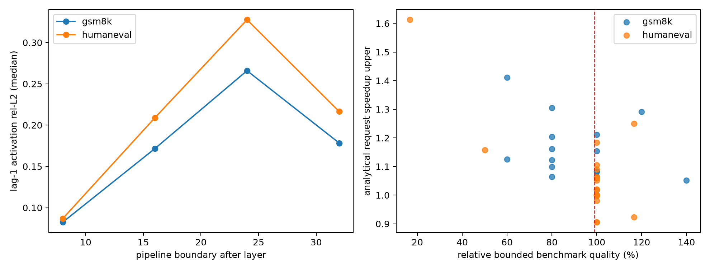

# Track B5 — speed/quality Pareto

The speed coordinate is a conservative analytical upper combining:

- measured per-wave, per-layer rank-critical timing;
- an exact fill/steady/drain flow-shop schedule for the selected cut;
- the policy's measured stale-row fraction;
- measured policy NFE relative to baseline;
- the observer-derived fraction of request wall attributable to the backbone.

It still omits PP implementation overhead and contention, so it is not an
observed speedup.

## Cross-task gate

Among policies with at least 99% relative bounded score on both tasks:

| Policy | GSM upper | Human upper | Worst task | NFE delta GSM/Human |
|---|---:|---:|---:|---:|
| PP4 W4/K8 | 1.291x | 1.184x | **1.184x** | +17 / +30 |
| PP4 W4/K2 | 1.212x | 1.060x | 1.060x | 0 / +14 |
| PP4 late-only W4/K4 | 1.051x | 1.063x | 1.051x | +5 / -2 |
| PP4 boundary-24 W4/K4 | 1.065x | 1.021x | 1.021x | +3 / +7 |

The `PP4 W4/K8` point does not satisfy the requested `>=1.3x at about 99%`
HOLD gate, and its very low sequence exactness shows substantial trajectory
drift.  No common policy reaches 1.2x on both tasks after NFE adjustment.

The headline result is therefore not the 2.13x ideal ceiling.  It is the
collapse from a 2.13x dependency-removal ceiling to at most 1.184x on the
worst task once one quality-preserving policy is selected—before real PP
overheads.

