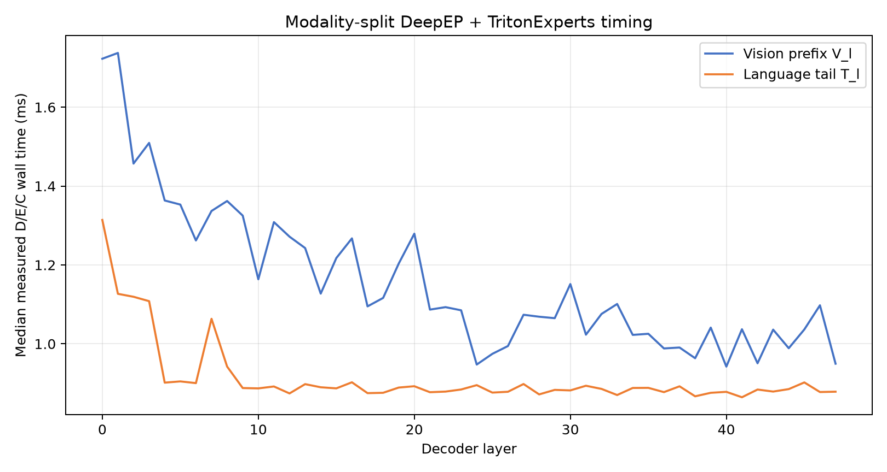
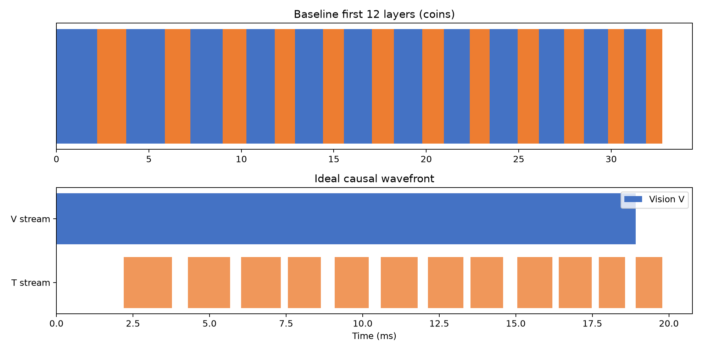
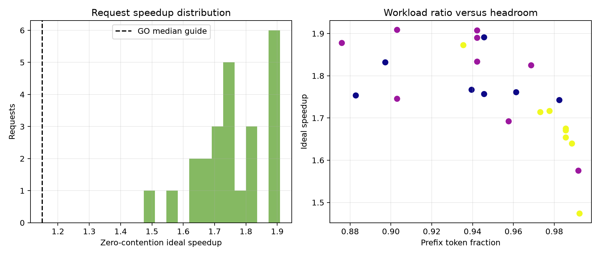

# Causal Modality Wavefront PoC

## Final status

`CAUSAL_MODALITY_WAVEFRONT: GO`

The causal prefix/tail dependency is mathematically valid, and the measured zero-contention operator-stage upper bound is 1.7550× median (p25 1.6878×, p95 1.9049×).

## Environment and fixed methodology

- Qwen3-VL-30B-A3B-Instruct BF16, TP2/DP2/EP4/PP1, vLLM 0.20, DeepEP high-throughput and TritonExperts.
- Physical GPUs 1,2,3,4 only; every rank artifact records `CUDA_VISIBLE_DEVICES=1,2,3,4`.
- Exact routes from the fixed previous 24 real-image workload, all 48 layers.
- Every route is split at the token immediately after the final repeated image token: the prefix includes system/user/image/vision-end tokens, and the tail contains only post-image question/generation-prompt tokens.
- Timing uses actual DeepEP dispatch, TritonExperts compute, and DeepEP combine with the validated real layer-24 BF16 activation template. Two warmups and seven measured repetitions are used per request/layer/component/rank. Four identical EP sources reproduce the validated replay convention.
- No model output, route ID, route weight, token, expert placement, weight, production scheduler, or kernel is modified.

This is a measured D/E/C operator-stage upper bound, not an end-to-end TTFT measurement: attention is not separately replayed, per-layer hidden values are represented by the layer-24 template, and splitting creates separate component collectives.

## POC1 — modality timing

Across requests/layers, median V_l duration is 1.129904 ms and median T_l duration is 0.887376 ms. Request-total Vision-prefix work is 55.38% median; prefix tokens are 95.17% of prompt tokens.

- Vision-prefix D/E/C medians: 0.233840 / 0.621600 / 0.208976 ms.
- Language-tail D/E/C medians: 0.193552 / 0.417648 / 0.118064 ms.

## POC2 — dependency validation

`CAUSAL_VALIDITY: VALID`

For the decoder's lower-triangular causal attention, a prefix query cannot read any later post-image key/value. RMSNorm, rotary embedding, router selection, expert MLPs, and residual updates are token-local; EP collectives move selected token rows but introduce no semantic cross-token reduction. Therefore V_{l+1} needs V_l but not T_l. T_l still needs the completed prefix state and its own previous-layer state, producing the fixed two-chain DAG represented by the requested formula. Current vLLM batches those rows together operationally, but that lockstep is an implementation choice rather than a model dependency.

## POC3 — zero-contention upper bound

- Median/p25/p95 speedup: 1.7550× / 1.6878× / 1.9049×.
- Median hidden-time fraction: 43.02%.
- Fraction of requests at least 1.15×: 100.00%.
- Formula: `V_1 + sum(max(V_l,T_(l-1))) + T_L`; thresholds and schedule were not changed post-hoc.

## Conditional two-stream diagnostic

fixed request `histology`, layer 24: 3.950032 → 3.036016 ms (1.3011×), correctness=True

This diagnostic, when run, is a bounded two-group DeepEP D/E/C wavefront on a preregistered medium request/layer. It is not a production cross-layer scheduler.

## Evidence and limitations

Strongest positive evidence: all 24 requests have a valid 47-slot overlap opportunity; median ideal operator-stage speedup is 1.7550×.

Strongest counter-evidence: the timing excludes attention and reuses layer-24 activations/weights, so the ideal result is not an end-to-end implementation result.

- Attention timing is absent, so the reported result cannot be called measured end-to-end TTFT speedup.
- The replay uses exact layer-specific routes but one real layer-24 activation template and layer-24 weights for all layer labels; it measures route/shape and communication cost, not hidden-value or weight variation across depth.
- Four-source replication increases absolute traffic relative to one live DP request; it is held identical for V and T.
- Zero-contention simulation ignores contention, launch coupling, KV-cache coordination, and separate-collective overhead beyond what component replay already measures.

## Conclusion

Real CUDA wavefront implementation justified: **YES, bounded prototype only**.

## Artifacts

- Result: `poc_flashvep/deepep_revalidation/results/causal_modality_wavefront_20260826_111452/`
- Derived component timing: `component_timing.csv`
- Request simulation: `request_wavefront.csv`
- Summary: `summary.json`

## Single recommended action

Implement one bounded live two-stream prefix/tail prototype with attention and one-layer-ahead dependency events; do not alter routing or kernels.
