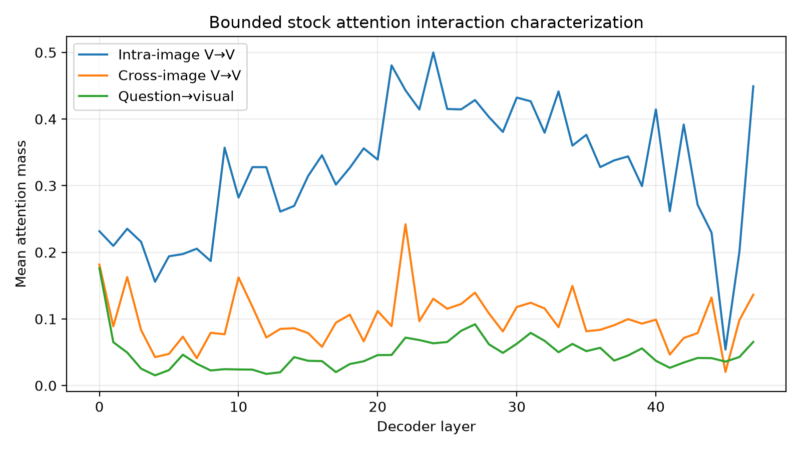
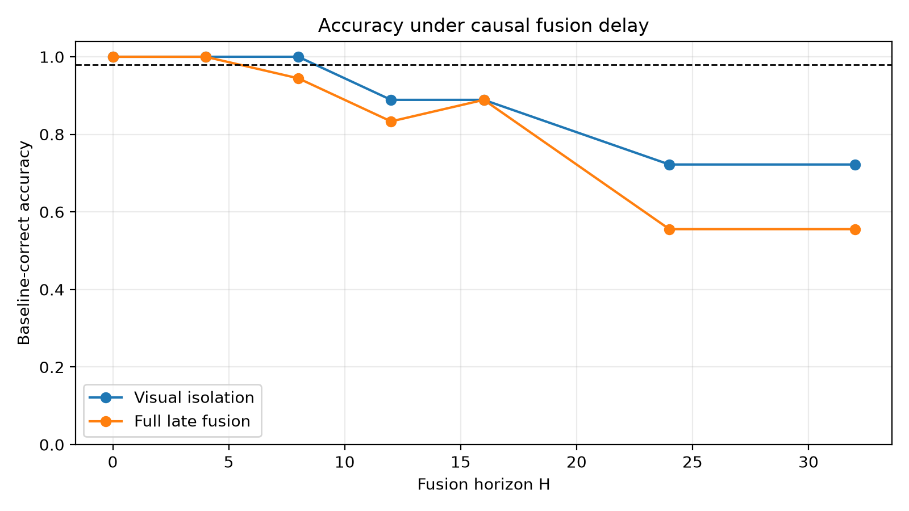
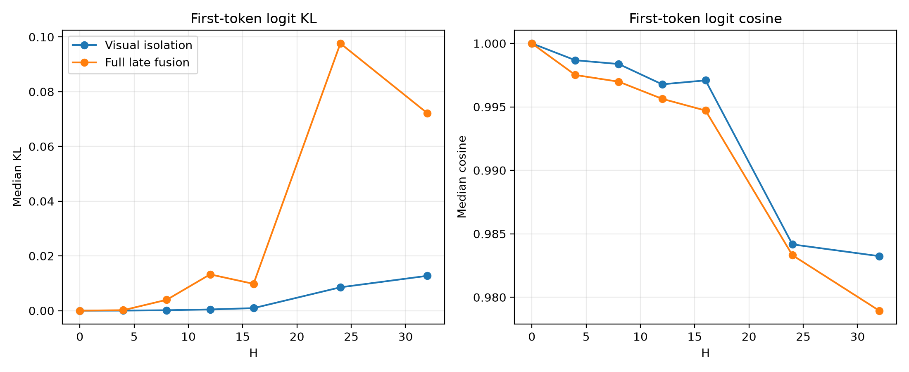
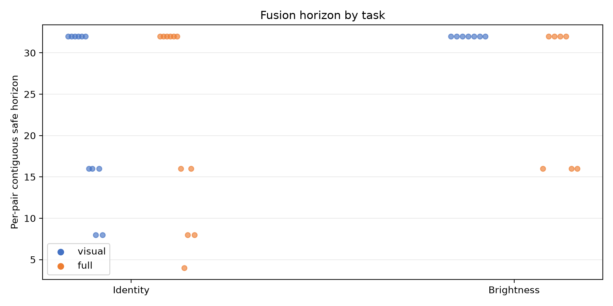

# Multi-Image Cross-Image Fusion Horizon PoC

## Final gate

`CROSS_IMAGE_FUSION_HORIZON: HOLD`

The primary full-late-fusion intervention was safe for the complete baseline-correct set only through layer 4, not through the preregistered GO horizon of layer 12. The result supports short, task-dependent fusion delay, but does not justify a general early per-image-parallel prefill system.

## Environment and scope

- Base commit: `8ace17be99262318bed4f27a329fe8b3ad6203ad`
- Model: Qwen3-VL-30B-A3B-Instruct, BF16
- Runtime: vLLM 0.20.0, PyTorch 2.11.0+cu129, Triton 3.6.0
- Topology: TP2 / DP2 / EP4 / PP1, DeepEP high-throughput, TritonExperts
- GPUs: physical 1,2,3,4 only; backend proof records `CUDA_VISIBLE_DEVICES=1,2,3,4` on all four EP ranks
- DBO off, prefix cache off, enforce eager
- No weights, routing, experts, token count, or MoE execution were modified. No parallel runtime was implemented.

## Fixed workload and policy

Before looking at intervention results, the experiment fixed 24 two-image pairs, 448×448 preprocessing, 196 visual tokens per image, and horizons `H={4,8,12,16,24,32}`. All prompts had 424 decoder input tokens and equal image-token counts.

- Identity task: 6 same-image pairs (`YES`) and 6 different-image pairs (`NO`).
- Brightness task: 12 ordered pairs (`FIRST`/`SECOND`) constructed from six high-contrast source pairs.
- Primary set: samples answered correctly by the stock model.
- GO rule: full late fusion safe through at least H=12 with no more than 2 percentage-point accuracy loss, across both tasks, followed by a clear degradation boundary.

Stock answered 18/24 pairs correctly: 11/12 identity and 7/12 brightness. This leaves the preregistered minimum primary coverage satisfied (at least 16 total and at least 6 per task), but the small brightness subset is a limitation.

## Intervention and correctness

The hook first executes stock vLLM attention so normal KV-cache writes remain intact. For affected prefill layers it then replaces only the attention result with a causal masked calculation using the already projected, normalized, rotary-embedded Q/K/V tensors.

- Visual isolation: before H, second-image visual queries cannot attend first-image visual keys. Causal token ordering already prevents the first image from attending the later second image.
- Full late fusion: visual isolation plus blocking post-image question/text queries from both visual spans before H.
- At H and later, stock attention is fully restored.

H=0 passed exactly: generated-token agreement 100%, answer agreement 100%, maximum full-vocabulary logit error 0, and minimum logit cosine effectively 1.0. All 360 source-request logit captures also agreed exactly between TP replicas (maximum error 0).

## POC2: stock interaction characterization

The bounded attention diagnostic used the first eight fixed stock pairs. It computes attention probabilities from stock Q/K after rotary embedding and reports mean mass; it is descriptive and was not used as the causal gate.

Cross-image visual attention was already nonzero at layer 0 (mean mass 0.182), while intra-image visual attention was 0.232. Cross-image mass remained nonzero throughout the stack and reached a sampled maximum of 0.242 at layer 22. Question-to-visual mass was 0.176 at layer 0, then generally lower but nonzero. Thus the evidence does not support literal early-layer independence.

## POC3: causal fusion delay

Primary baseline-correct accuracy:

| H | Visual isolation | Full late fusion | Full median logit KL | Full median cosine |
|---:|---:|---:|---:|---:|
| 0 | 100.00% | 100.00% | 0 | 1.000000 |
| 4 | 100.00% | 100.00% | 0.000167 | 0.997510 |
| 8 | 100.00% | 94.44% | 0.003965 | 0.996984 |
| 12 | 88.89% | 83.33% | 0.013248 | 0.995635 |
| 16 | 88.89% | 88.89% | 0.009791 | 0.994709 |
| 24 | 72.22% | 55.56% | 0.097653 | 0.983316 |
| 32 | 72.22% | 55.56% | 0.072186 | 0.978946 |

The aggregate contiguous safe horizon is H=8 for visual isolation and H=4 for full late fusion. The non-monotonic accuracy at H=12 versus H=16 is reported as measured; it is not treated as recovery of a safe contiguous horizon.

## POC4: task dependence

| Task | Primary samples | Visual safe H | Full safe H | Full accuracy at H=12 | Full accuracy at H=24 |
|---|---:|---:|---:|---:|---:|
| Identity | 11 | 8 | 4 | 72.73% | 54.55% |
| Brightness | 7 | 32 | 16 | 100.00% | 57.14% |

Brightness comparison provides the strongest positive evidence: full late fusion retained 7/7 answers through H=16, then fell to 4/7 at H=24, a clear boundary. Visual isolation retained all seven brightness answers through H=32. In contrast, identity discrimination lost one answer by full H=8 and three by H=12; visual isolation also fell at H=12. The fusion horizon is therefore task-dependent rather than a universal fraction of model depth.

## Interpretation

Strongest positive evidence: a bounded comparison task tolerated complete question/image and cross-image visual isolation for the first 16 of 48 layers with no primary-set answer loss, then showed a large, coherent drop at H=24.

Strongest counter-evidence: the identity task required full fusion by layer 8 to stay within the 2-point gate, and the aggregate full intervention already lost 5.56 points at H=8. Stock attention also showed cross-image mass from layer 0.

Consequently, early per-image parallel prefill is not causally justified as a general Qwen3-VL execution policy. A task-aware or confidence-gated design might have headroom, but implementing it now would exceed the evidence and this PoC's scope.

## Limitations

- Only 24 controlled pairs and two synthetic, exact-answer task families were used; 18 were stock-correct.
- Images were resized to one fixed 448×448 grid, so resolution and multi-grid effects are untested.
- Four-token greedy outputs make answer consistency well-defined but do not test long-form generation.
- The attention-mass diagnostic manually materializes attention probabilities and changes performance characteristics, so it is used only descriptively. The causal evaluation measures correctness, not latency.
- The manual masked attention uses FP32 score/softmax computation. H=0 bypasses it and proves harness identity, but intervention logits combine masking with this numerically different attention implementation. The large answer/task effects, rather than bit-exact logits, are the primary evidence.
- Because decoder attention is causal, cross-image visual isolation is directional: only later image tokens could see earlier image tokens in stock ordering.

## Artifacts

- Result directory: `poc_flashvep/deepep_revalidation/results/cross_image_fusion_horizon_20260825_1719/`
- Aggregate gate: `summary.json`
- Per-pair metrics: `per_pair_metrics.csv`
- Task summary: `task_horizon_summary.csv`
- Interaction summary: `interaction_by_layer.csv`
- Workload and fixed policy: `manifest.json`
- Reproduction entrypoint: `poc_flashvep/scripts/run_cross_image_fusion_horizon.sh`

## Single recommended next action

Run one preregistered held-out replication focused on exact-answer comparison tasks versus identity/retrieval tasks, with more baseline-correct pairs, before considering any task-gated image-parallel execution design.
