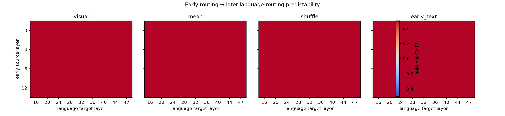
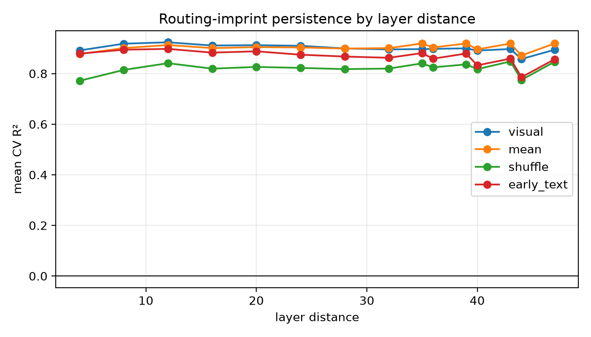

# Cross-Modal Routing Imprint PoC

## Final gates

- `PREDICTIVE_IMPRINT: NO-GO`
- `CAUSAL_IMPRINT: NOT-RUN`
- `COMPRESSION_HEADROOM: NOT-RUN`
- Imprint-Preserving Visual Compression is **not justified** by this PoC.

POC1/2 did not pass the preregistered HOLD gate, so POC3 route intervention and
POC4 concentration were not run. No model weight, router, routing choice,
expert placement, or training state was changed.

## Configuration and workload

- Model: Qwen3-VL-30B-A3B-Instruct, BF16
- Topology: TP2 / DP2 / EP4 / PP1, DeepEP high-throughput, DBO off
- GPUs: physical 1, 2, 3, 4 only (`CUDA_VISIBLE_DEVICES=1,2,3,4`)
- Samples: 48 unique local source images
- Image control: every source was resized to exactly 448x448 before processing
- Processor result: 196 visual tokens for every request
- Text control: identical `Describe the image briefly.` probe for every image
- Language target: the 11 post-visual question/assistant-prefix prompt tokens
- Capture: all 48 MoE layers and original top-8 expert IDs for every prompt token

All 48 requests produced one output token. Both DP captures completed with 24
requests, every route tensor had expert IDs in `[0, 127]`, and TP sequence
shards were reassembled before request attribution.

## Preregistered analysis

The analysis policy was written to `analysis_policy.json`: source layers
0/4/8/12, target layers 16/20/24/28/32/36/40/44/47, long range at distance
at least 24, six-fold shuffled held-out-image CV, Ridge alpha 1.0, and top-K 8.
The target is the normalized 128-expert routing mass of the post-visual
language span. Baselines are training-fold global mean, ten deterministic
shuffles of visual-routing predictors, and early text routing.

The GO rule required a long-range visual R2 advantage of at least 0.10 over
both mean and shuffled baselines in at least half of long-range cells. HOLD
required an R2 or JSD improvement of at least 0.02 in at least 25% of those
cells. These rules, source/target layers, and sample suite were not changed
after results were observed.

## POC1 — Predictive imprint

Across all tested layer pairs:

| Predictor | CV R2 | JSD | Top-1 agreement | Top-8 overlap |
|---|---:|---:|---:|---:|
| Visual route | 0.9035 | 0.0860 | 62.38% | 88.32% |
| Global mean | 0.9026 | 0.0899 | 59.72% | 89.27% |
| Shuffled visual | 0.8222 | 0.1306 | 54.47% | 84.10% |
| Early text route | 0.8712 | 0.1045 | 57.00% | 86.21% |

The visual predictor beats a shuffled input, but it does not materially beat
the more important held-out global-mean baseline. The shared fixed prompt has a
highly stable language-routing distribution, so high absolute R2 is not by
itself evidence of an image-specific imprint.

The strongest long-range cell was layer 4 to layer 28:

| Predictor | CV R2 | JSD | Top-1 | Top-8 |
|---|---:|---:|---:|---:|
| Visual route | 0.8952 | 0.08635 | 52.08% | 93.75% |
| Global mean | 0.8640 | 0.10344 | 60.42% | 91.67% |
| Shuffled visual | 0.7621 | 0.14723 | 50.00% | 87.60% |
| Early text route | 0.8269 | 0.12313 | 56.25% | 89.32% |

This isolated cell has only +0.0311 R2 over the strongest baseline and even
loses top-1 agreement to the mean baseline. It does not satisfy the material,
repeated long-range criterion.

## POC2 — Persistence

For long-range cells, the averaged results were:

| Predictor | CV R2 | JSD | Top-1 agreement | Top-8 overlap |
|---|---:|---:|---:|---:|
| Visual route | 0.8971 | 0.08787 | 53.79% | 87.38% |
| Global mean | 0.9026 | 0.08836 | 46.59% | 88.53% |
| Shuffled visual | 0.8224 | 0.12860 | 45.07% | 83.54% |
| Early text route | 0.8600 | 0.10862 | 47.82% | 84.93% |

Relative to the stronger of global mean and shuffled controls, mean long-range
R2 advantage was **-0.00546** and mean JSD advantage was **+0.00049**. No
long-range cell met the GO margin; only **4.55%** met the preregistered HOLD
cell criterion. Predictive power therefore does not persist beyond what the
stable fixed-prompt prior already explains.

## Conditional POC3/4

Not run. POC1/2 are NO-GO, and proceeding would violate the conditional gate.
Consequently there is no donor-attraction result, causal-imprint claim, or
imprint-concentration curve.

## Interpretation and limitations

The strongest positive evidence is that real early visual routes predict some
later language distributions better than shuffled visual routes, most clearly
at layer 4 to layer 28. The strongest counter-evidence is that the simple
training-fold mean is equally good or better across long-range cells. Thus the
experiment finds correlation with the common language-routing prior, not a
material held-out-image-specific persistent imprint.

The result is bounded to one fixed short probe, one 448x448 processor grid, 48
local images, and routing IDs rather than router logits. The fixed prompt is the
intended text-confound control, but its 11-token language target is short and
very stable. This does not prove that no causal imprint exists for longer or
interactive language contexts; it shows that the proposed phenomenon lacks
the required headroom under the preregistered controlled test.

## Artifacts

- Result directory: `poc_flashvep/deepep_revalidation/results/cross_modal_routing_imprint_20260825_141353/`
- Full metrics: `predictive_metrics.csv`
- Persistence summary: `persistence.csv`
- Gate summary: `summary.json`
- Capture audit: `capture_integrity.json`, `capture.dp0.json`, `capture.dp1.json`
- Figures: `figures/plot1_cross_layer_predictability.png`, `figures/plot2_imprint_persistence.png`

## Next single recommended action

Stop the Imprint-Preserving Visual Compression direction and return to a
different, independently motivated systems mechanism; do not implement causal
route substitution or compression from these results.
