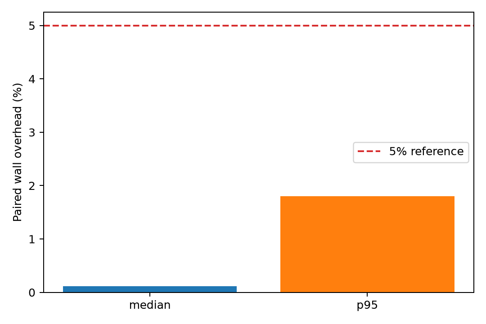
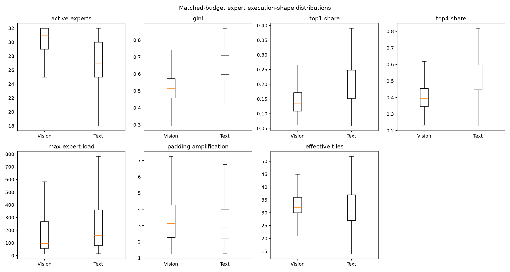
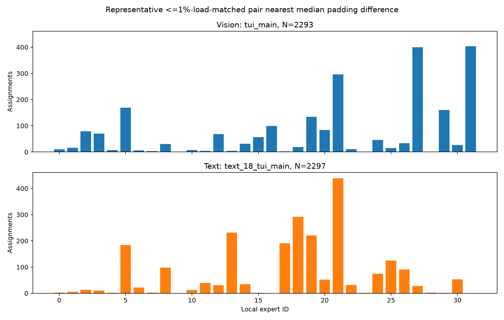
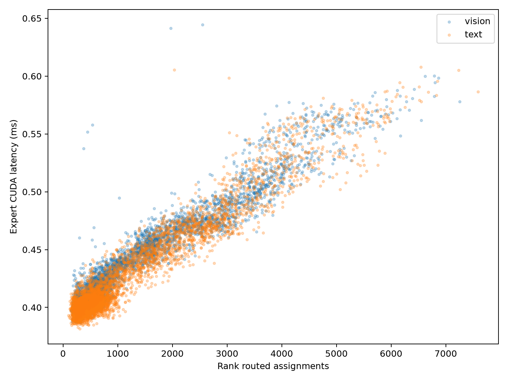
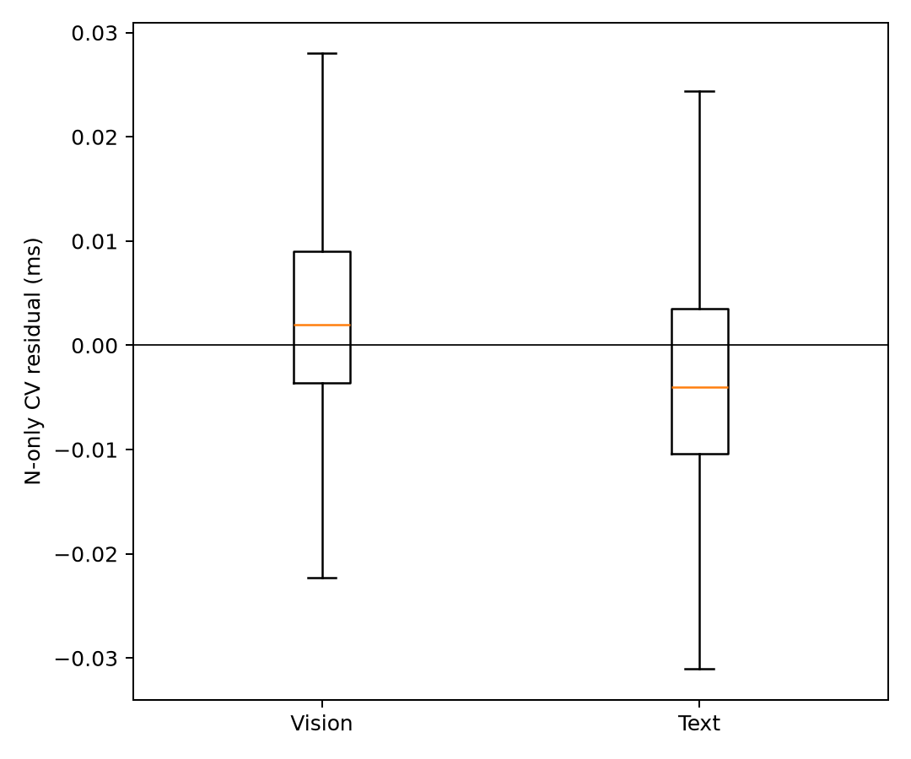
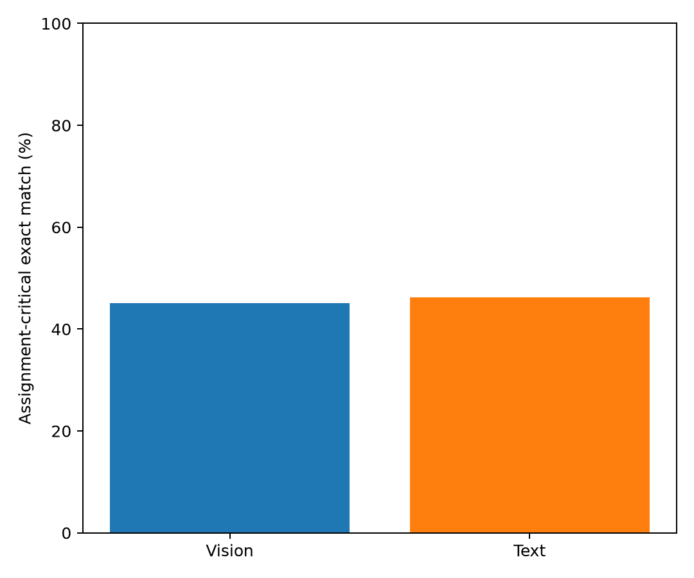
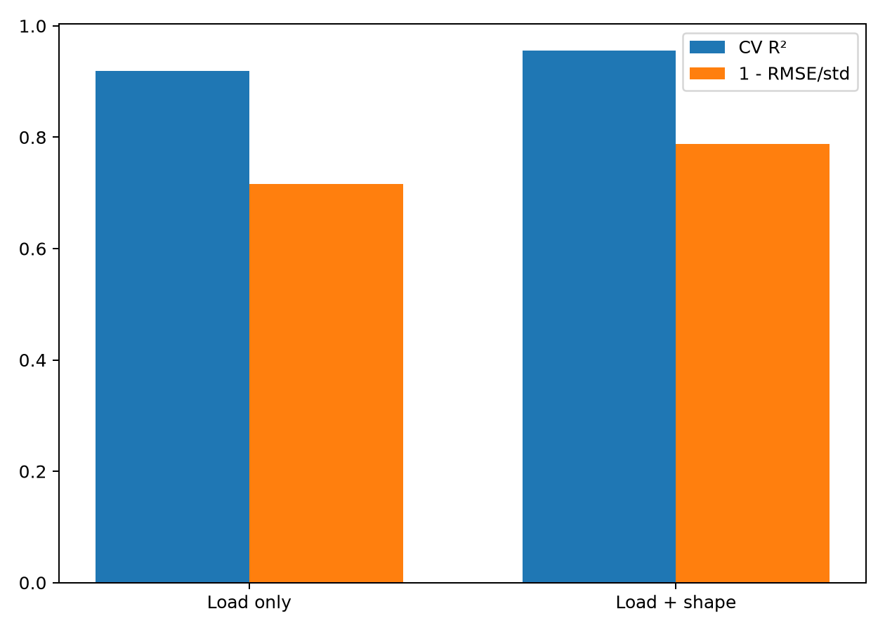
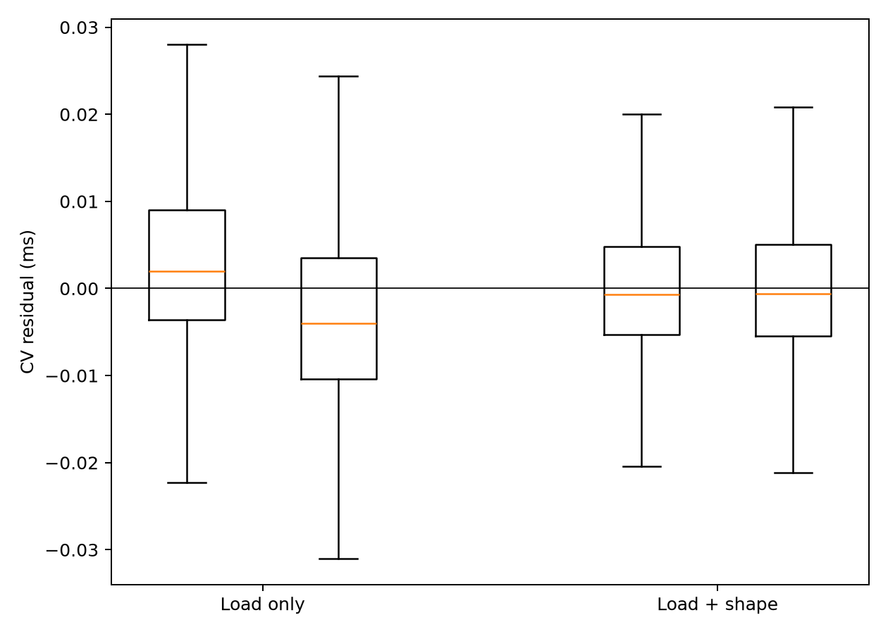
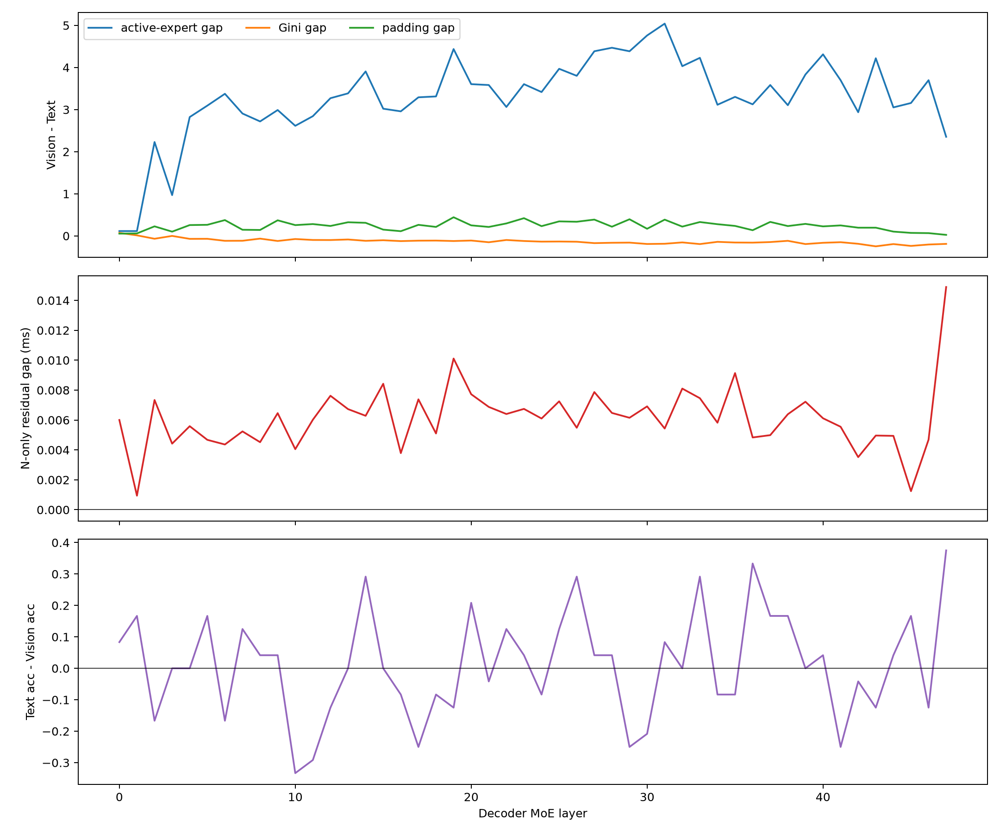
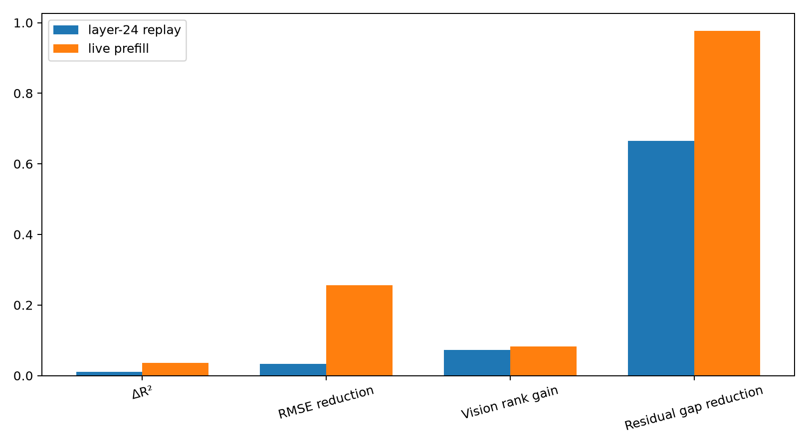

# FlashVEP Live-Prefill Modality Execution-Regime Validation

## Environment and fixed workload

Qwen3-VL-30B-A3B-Instruct, BF16, TP2/DP2/EP4/PP1, vLLM 0.20, DeepEP high-throughput, TritonExperts, eager mode, DBO/prefix caching disabled, physical GPUs 4,5,6,7. The exact previous 24 Vision + 24 Text pairs were copied byte-for-byte; maximum decoder-token mismatch remains 0.063%. Each wave had exactly one active global request, with the other DP rank joining the same EP collective idle, so all four EP timings have unambiguous request attribution.

## Stage A — instrumentation validation

`STAGE_A_STATUS: HOLD`

Same-stream start/end events surround only live `TritonExperts` compute after DeepEP dispatch and before combine. Events were resolved after all measured requests, never with a per-layer synchronize. Median/p95 paired wall overhead were 0.12%/1.80%. Route exactness was 37.00% over 138240 comparisons; output repeatability was True.

Route exactness here is 15-repeat stability in the current one-request live context. The prior 12-request batched-capture histogram containment diagnostic is 0.59%; it is not used to relabel the live gate and is retained because changing batch context can move BF16 router boundary decisions.

## Stage B — live modality shape

`STAGE_B_STATUS: GO`

| Metric | Vision median | Text median | <=5% rank-load matched Vision-Text |
|---|---:|---:|---:|
| active experts | 31.000 | 27.000 | 3.314 |
| Gini | 0.5134 | 0.6541 | -0.1283 |
| padding amplification | 3.1291 | 2.8986 | 0.3004 |

The histogram and feature definitions, runtime `BLOCK_SIZE_M` lookup, matching, bootstrap, and gate are unchanged from the replay PoC.
Observed live Triton `BLOCK_SIZE_M` values were [32, 64, 128]. When idle-DP padding produced multiple live histograms across repetitions, the representative shape was the actual histogram paired with that observation's median-latency repetition; no component-wise synthetic histogram was created.

## Stage C — live load/latency

`STAGE_C_STATUS: HOLD`

Vision/Text assignment-latency Spearman are 0.9281/0.8823. The grouped-CV N-only mean residual gap is 0.006132 ms, 95% CI [0.003899, 0.008400]; the median-gap relative effect is 1.44%. The <=5% rank-load matched raw latency gap is 0.005398 ms.

Timing repeatability across the 9,216 request/layer/rank observations: median CV 3.25%, p95 14.68%, >10% 10.10%, >20% 2.73%, maximum 366.35%. No post-hoc outlier was removed.

## Stage D — live critical-rank proxy

`STAGE_D_STATUS: NO-GO`

Assignment-critical exact match is 45.05% Vision and 46.18% Text; top-2 inclusion is 70.31%/70.75%. Vision-minus-Text exact difference is -1.13%, request-clustered 95% CI [-10.50%, 7.55%]. The fixed imbalance-matched difference is 4.34%.

## Stage E — live shape mediation

`STAGE_E_STATUS: HOLD`

| Model | CV R² | RMSE ms | MAE ms | Spearman | Vision rank | Text rank | top-2 overall |
|---|---:|---:|---:|---:|---:|---:|---:|
| load only | 0.9192 | 0.012254 | 0.008868 | 0.8986 | 45.05% | 46.18% | 70.53% |
| load + shape | 0.9552 | 0.009124 | 0.006428 | 0.9395 | 53.30% | 54.25% | 77.39% |

ΔR²=+0.0360, RMSE reduction=25.55%, MAE reduction=27.51%, Vision/Text rank gains=8.25%/8.07%, residual-gap reduction=97.73%. The same linear load-only model, standardized ridge feature set, and request-grouped five-fold split were retained.

## Stage F — layer-wise diagnostic

`STAGE_F_RESULT: MIXED`

The strongest eight-layer shape-shift region is layers 26–33. Layer-level Spearman is 0.3177 for shape-gap versus latency-residual gap and -0.0601 for shape-gap versus proxy-failure gap. This is diagnostic over only 48 layers, not a new claim.

## Replay versus live

| Metric | Layer-24 replay | Live prefill |
|---|---:|---:|
| Vision/Text residual gap (ms) | 0.017931 | 0.006132 |
| Vision critical-rank accuracy | 57.73% | 45.05% |
| Text critical-rank accuracy | 68.40% | 46.18% |
| critical-rank gap | -10.68% | -1.13% |
| load-only R² | 0.8445 | 0.9192 |
| load+shape R² | 0.8546 | 0.9552 |
| ΔR² | 0.0102 | 0.0360 |
| RMSE reduction | 3.32% | 25.55% |
| Vision rank-accuracy gain | 7.29% | 8.25% |
| residual-gap reduction | 66.47% | 97.73% |

`LIVE_STRENGTHENED_MEDIATION: PARTIALLY`

## Final gate

`FINAL NOVELTY STATUS: NO-GO`

Strongest MLLM-specific evidence: Fixed live shape features reduce RMSE by 25.55%, improve Vision rank prediction by 8.25%, and reduce the modality residual gap by 97.73%.

Strongest counter-evidence: The Vision-specific token critical-rank gap collapses to -1.13% with a CI spanning zero and reverses to 4.34% after the fixed imbalance match.

This differs from generic [TEMPO](https://arxiv.org/abs/2608.13057)/[DA-MoE](https://arxiv.org/abs/2607.23099) observations only if the live modality-conditioned proxy gap is substantially mediated by these fixed execution-shape features. It is **not clearly distinguished here** because the live Vision-specific proxy-failure gap disappears. The final gate does not claim novelty for token-count insufficiency, routing concentration, or GEMM tiling themselves.

Recommended framing: `generic shape-aware MoE behavior; reconsider Vision-specific framing`.

## Limitations

- One model, BF16 precision, expert placement, H100 topology, Triton/DeepEP backend, and 24 bounded local pairs are covered.
- One active global request per wave is required for exact request attribution; this does not characterize multi-request contention.
- CUDA events isolate local Triton expert compute and intentionally exclude dispatch/combine and end-to-end latency.
- Stock idle-DP padding adds two routed rows and its expert histogram is not repeat-exact (overall exact-repeat fraction 37.00%); this is why Stage A is HOLD even though outputs and event attribution are valid.
- Layer-wise correlations use 48 layers and are descriptive.

## Next single recommended action

Repeat only the fixed live measurement with source-token labels that separate real-request assignments from the two idle-DP padding rows; do not design a scheduler first.

## Figures

