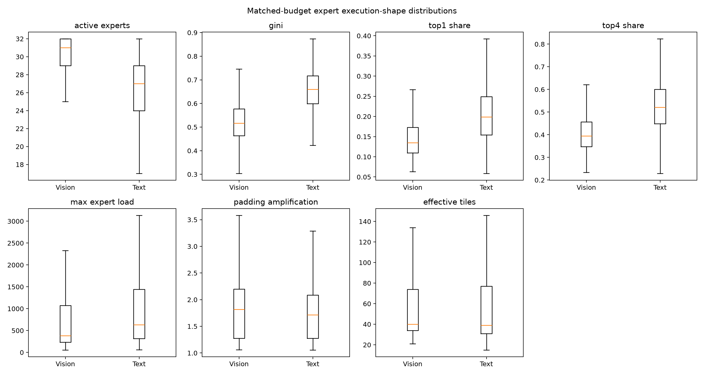
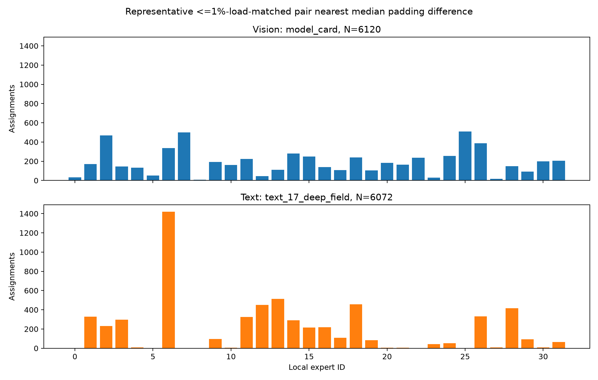
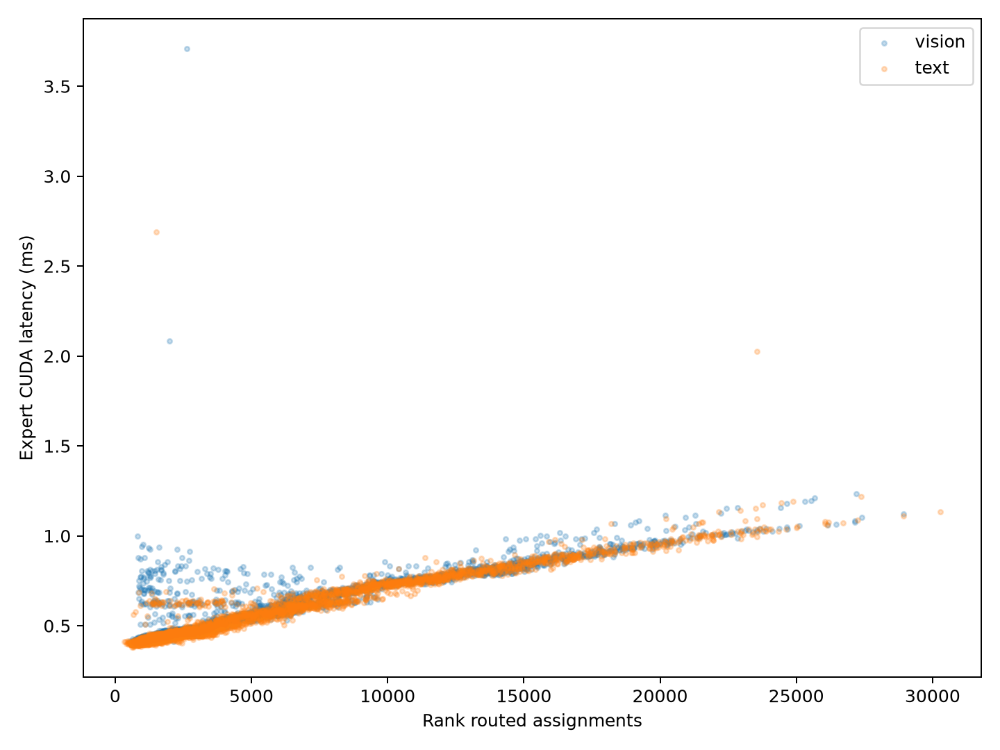
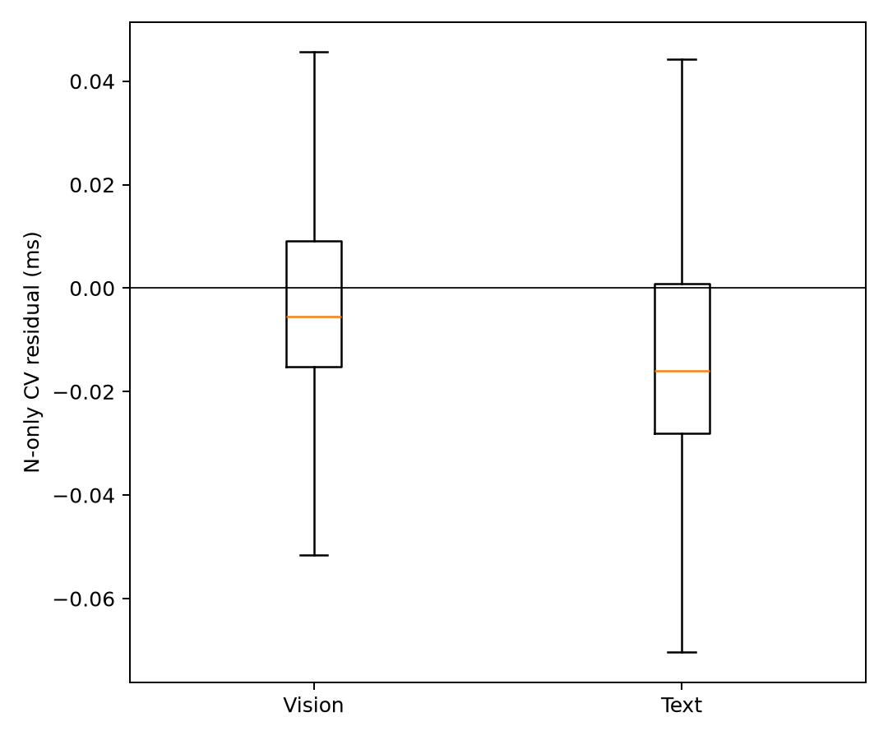
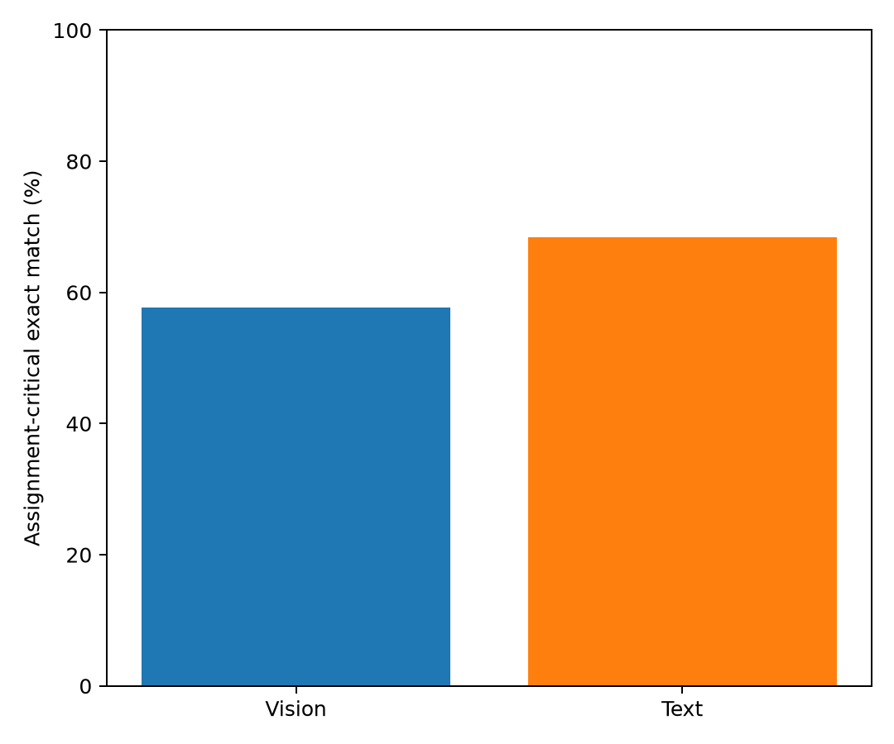
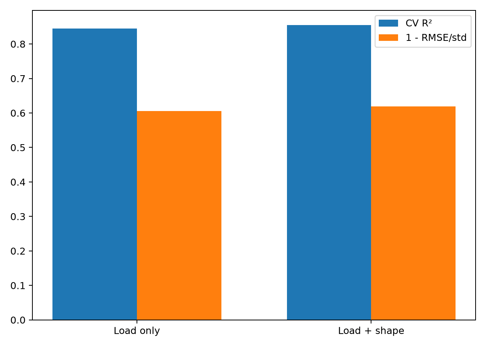
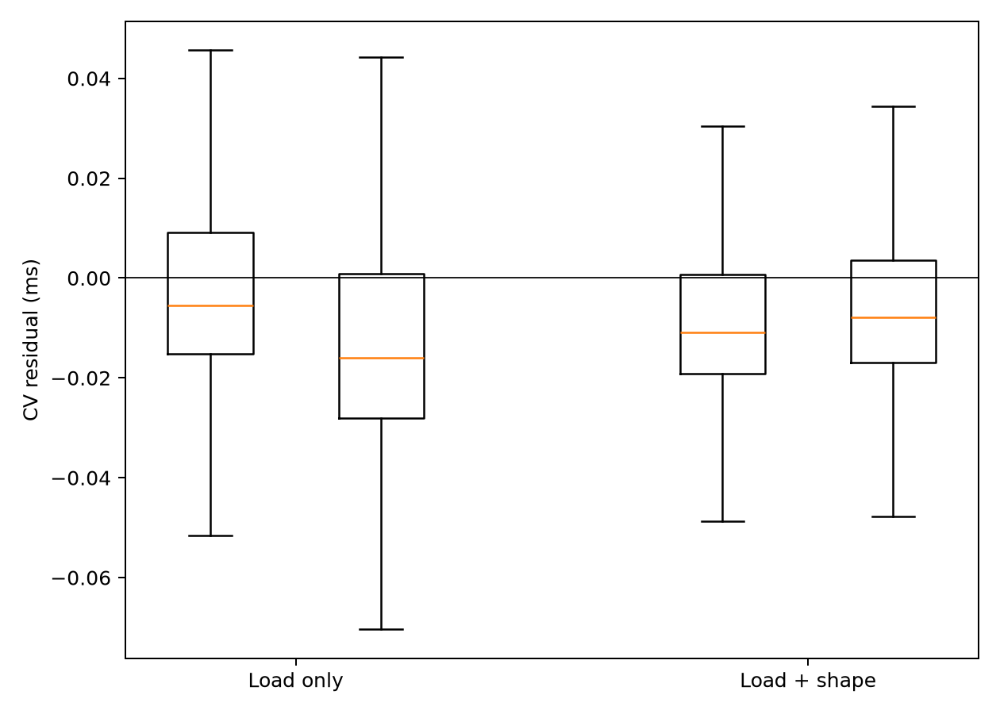

# FlashVEP Modality-Induced Execution Regime PoC

## 1. Environment

Qwen3-VL-30B-A3B-Instruct, BF16, TP2/DP2/EP4/PP1, vLLM 0.20, DeepEP high-throughput, eager mode, physical GPUs 4,5,6,7. Backend proof records `TritonExperts` and `DeepEPHTPrepareAndFinalize`. Routing IDs and weights were not changed. CUDA timing used 3 warmups and 15 measured iterations; observation-level timing CV has median 2.49% and p95 5.64%.

## 2. Vision/Text workload construction and matching

The suite contains 24 real-image requests reused from the prior 34-sample capture and 24 text-only requests made from distinct local documentation prose. Text was truncated in tokenizer space and passed through the model chat template; no sentence was repeated to inflate length. There are 8 pairs per small/medium/large range. Maximum effective decoder-token mismatch is 0.063%. The manifest contains source paths and SHA-256 values.

## 3. Stage B — modality to execution shape

`STAGE_B_STATUS: GO`

The exact Triton `BLOCK_SIZE_M` was obtained from the same `try_get_optimal_moe_config` call used by `TritonExperts`; observed values were [64, 128]. No 128-row assumption was hardcoded. Histogram counts reflect the validated four-source-rank replay, hence are exactly 4x captured assignments while preserving expert shares.

| Metric | Vision median | Text median | sequence-matched effect | rank-load-matched effect | rank-load-matched 95% CI |
|---|---:|---:|---:|---:|---:|
| active_experts | 31.000000 | 27.000000 | 1.2653 | 1.2585 | [3.086399, 4.282139] |
| gini | 0.517000 | 0.659870 | -1.4805 | -1.2018 | [-0.150956, -0.110993] |
| top1_share | 0.135086 | 0.199107 | -0.9763 | -0.7600 | [-0.075249, -0.052093] |
| top4_share | 0.394722 | 0.521570 | -1.1919 | -0.9112 | [-0.139884, -0.097292] |
| max_expert_load | 380.000000 | 632.000000 | -0.2633 | -0.4580 | [-386.830658, -174.058532] |
| padding_amplification | 1.816942 | 1.714911 | 0.1430 | 0.2618 | [0.004473, 0.206051] |
| effective_tiles | 40.000000 | 39.000000 | 0.0327 | 0.3589 | [0.670051, 2.295609] |

Caption: request-clustered Vision/Text shape distributions under matched decoder-token budgets. The gate additionally uses 2026 nearest-rank-load observations (43.97% of Vision rank observations) within 5% assignment error. Interpret persistent differences across both controls as modality-associated shape evidence, not the generic claim that shape matters.

Caption: the representative pair is selected mechanically among <=1% rank-load matches as the sample nearest the median padding-amplification difference; it is not the maximum contrast.

## 4. Stage C — modality-specific load/latency mapping

`STAGE_C_STATUS: HOLD`

Vision assignment/latency Pearson, Spearman, R² are 0.8866, 0.9142, 0.7861. Text values are 0.9550, 0.9580, 0.9120. The grouped-CV N-only mean residual gap (Vision minus Text) is 0.017931 ms, 95% CI [0.008921, 0.026032], effect size 0.2751. In the explicit <=5% rank-load-matched subset, the raw latency difference is 0.018364 ms, 95% CI [0.010692, 0.026698].

Caption: actual CUDA expert latency against received rank assignments, separated by request modality.

Caption: request-grouped cross-validation residuals from the same linear N-only predictor.

## 5. Stage D — critical-rank prediction

`STAGE_D_STATUS: GO`

Assignment-critical exact match is 57.73% for Vision and 68.40% for Text. Vision-minus-Text difference is -10.68%, request-clustered 95% CI [-21.18%, -0.52%]. After token-bucket and rank-imbalance matching, the accuracy difference is -7.20% (mean absolute imbalance-CV mismatch 0.038579).

Caption: raw argmax routed-assignment proxy accuracy, computed separately for Vision and Text request/layers.

## 6. Stage E — load-only vs shape-aware model

`STAGE_E_STATUS: HOLD`

The load-only grouped-CV model has R² 0.8445, RMSE 0.065791 ms, and MAE 0.027050 ms. The simple standardized ridge load+shape model has R² 0.8546, RMSE 0.063607 ms, and MAE 0.022592 ms. R² gain is 0.0102; RMSE reduction is 3.32%. Critical-rank accuracy changes from {'text': 0.6840277777777778, 'vision': 0.5772569444444444} to {'text': 0.7621527777777778, 'vision': 0.6501736111111112}; Vision gain is 7.29%. The modality residual gap reduction is 66.47%.

Caption: request-grouped cross-validation comparison; all 48 layers from a request remain in one fold.

Caption: modality residual distributions before and after adding shape features.

## 7. Overall novelty gate

`FINAL NOVELTY STATUS: HOLD`

This PoC does not claim novelty for token-count limitations, GEMM tiling, or expert-distribution effects themselves. The only candidate MLLM-specific observation is whether visual prefill systematically creates a distinct execution regime and a disproportionately poor token-count straggler proxy. The staged gates above determine whether that stronger statement is supported.

## 8. Strongest evidence and counter-evidence

The strongest MLLM-specific positive evidence is that, inside the explicit <=5% rank-load-matched subset, Vision activates 3.70 more local experts on average (paired effect 1.26; 95% CI [3.09, 4.28]) and has 0.131 lower Gini (paired effect -1.20; 95% CI [-0.151, -0.111]). The raw token proxy also matches the critical rank 57.73% for Vision versus 68.40% for Text, a -10.68% difference whose 95% CI is [-21.18%, -0.52%].

The strongest counter-evidence is failed shape mediation: load+shape improves grouped-CV R² by only 0.0102, lowers RMSE by only 3.32%, and improves Vision critical-rank accuracy by only 7.29%. Thus the data establishes a modality-associated routing-shape shift, but not yet that these simple shape features explain the critical-rank gap.

## 9. Confounders and limitations

- Vision routes come from live Qwen3-VL prefill; text routes are newly captured live. CUDA timing uses a validated layer-24 hidden-state template with every request's real route histogram, so it isolates routing shape but is not end-to-end layer-specific activation timing.
- Every EP source rank replays the same route. Counts scale by four and expert shares remain exact, but cross-request DP diversity is absent.
- The 24 images are bounded local samples, not a benchmark-random population. Text is local technical documentation, not a general-language benchmark.
- Pairs are matched on decoder sequence length; the secondary nearest-rank-load analysis may reuse Text observations and is descriptive.
- A first 2-warmup/7-iteration replay was retained as `replay_initial_7iter/`. It produced the same overall HOLD but put Stage D just below its practical threshold (Vision/Text 50.00%/59.98%) and Stage E at NO-GO. The primary 3/15 replay moved these to GO/HOLD. Median timing CV is low, but rare observations still have high interference tails (maximum CV 252.66%; 1.01% exceed 20%), so boundary-stage labels are not claimed as invariant.
- One model, placement, precision, kernel family, and H100 topology are covered. No resolution sweep was run.

## 10. Relation to generic TEMPO/DA-MoE observations

The analysis treats token-count insufficiency and makespan regimes in [TEMPO](https://arxiv.org/abs/2608.13057), and routing-distribution/kernel sensitivity in [DA-MoE](https://arxiv.org/abs/2607.23099), as generic prior observations. Only a reproducible modality-conditioned residual, a larger Vision critical-rank failure, and mediation by measured execution-shape features would distinguish this result. The first two signals appear here, but mediation remains HOLD; therefore this PoC does not establish a novelty claim beyond those generic observations.

## 11. Next single recommended action

Run one bounded live-prefill per-layer expert-timing validation of these same 24 matched pairs, retaining the fixed features and gates, to determine whether layer-24 template replay is masking the missing shape mediation; do not design a scheduler first.
