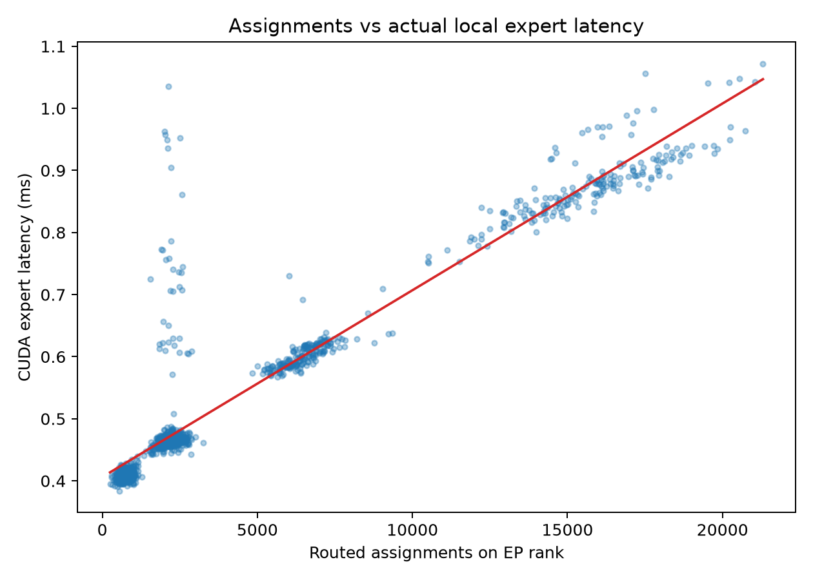
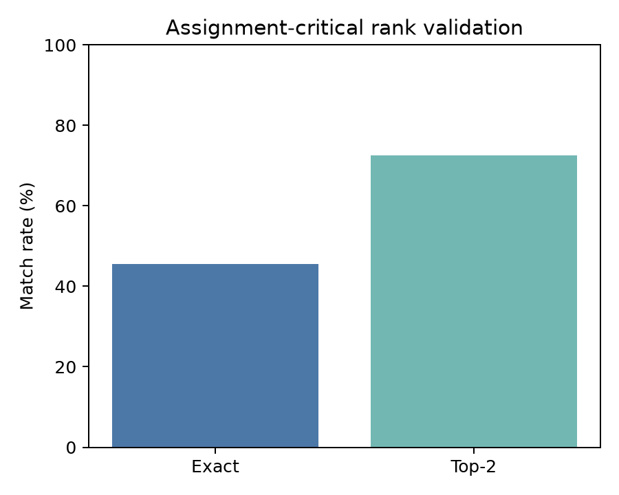
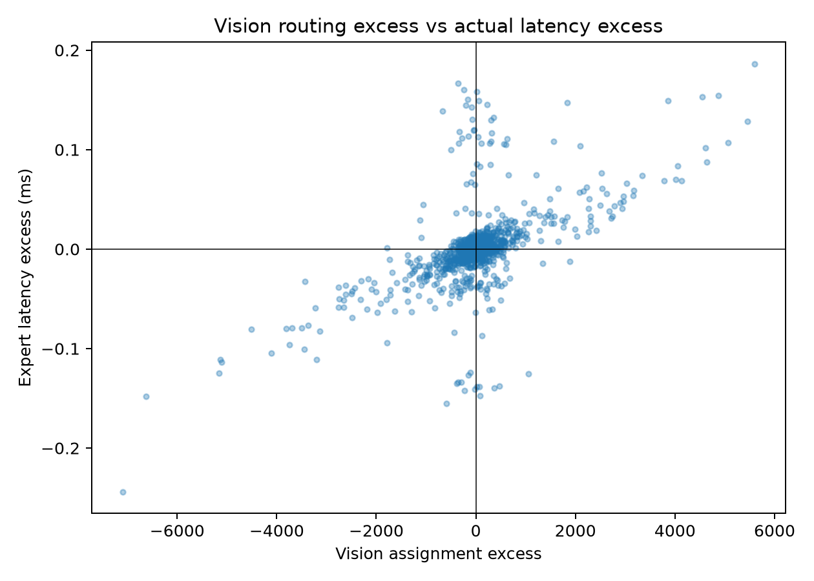
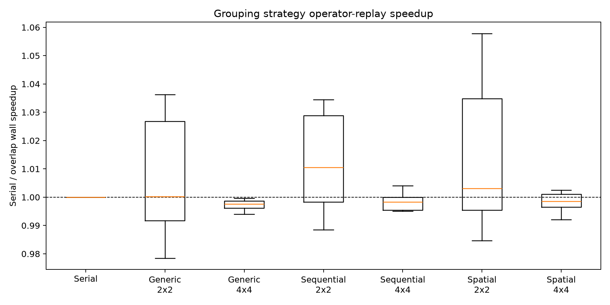
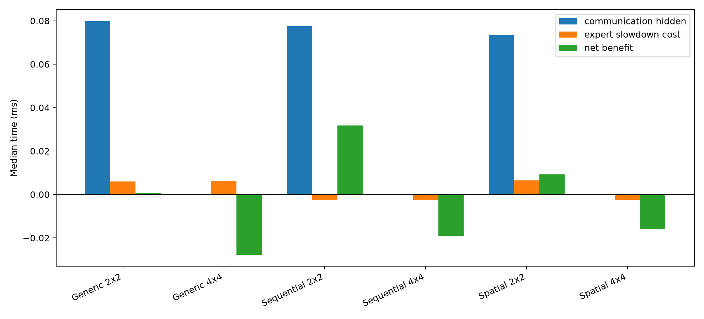
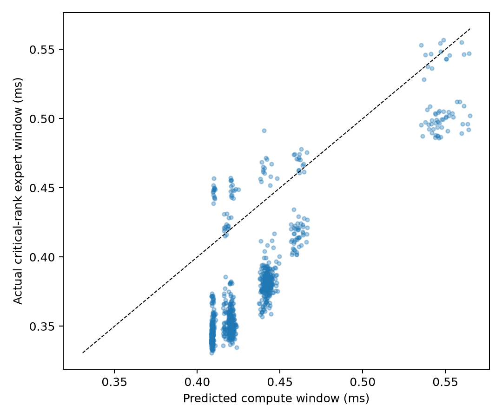
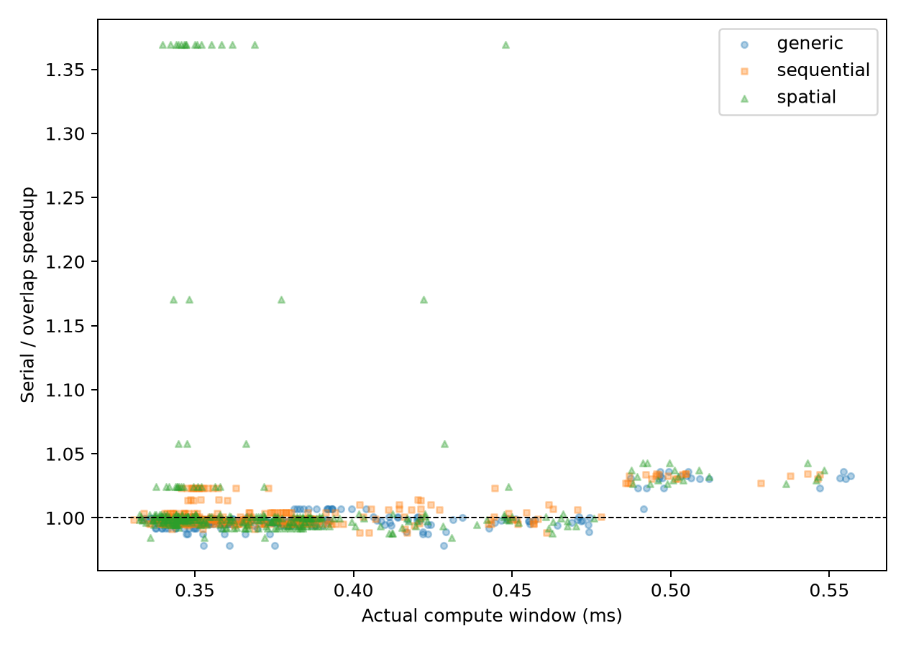
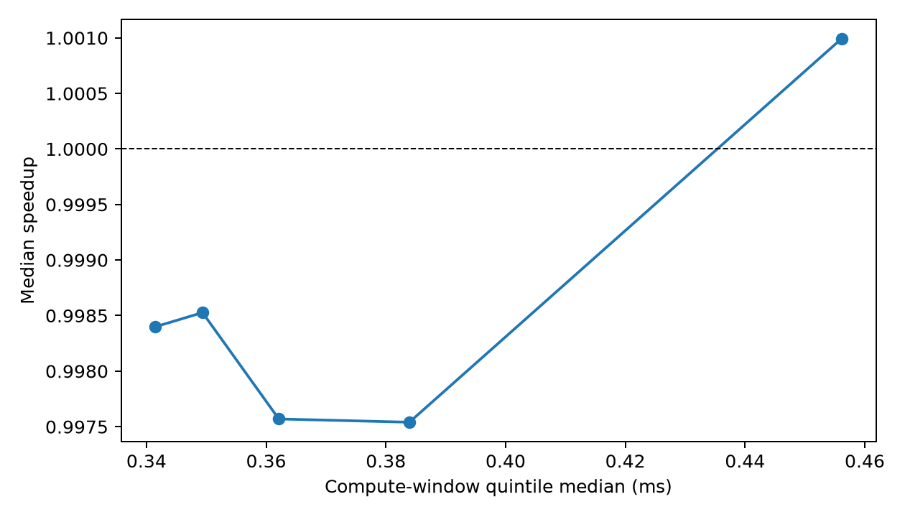

# FlashVEP Tile-to-Slack Mechanism Validation

## 1. Environment

Qwen3-VL-30B-A3B-Instruct, BF16, TP2/DP2/EP4/PP1, vLLM 0.20,
DeepEP high-throughput, eager execution, physical GPUs 4–7 only. Installed
Attention/DeepStack source fixes and software versions were retained.

Stage B–D are scheduler-free operator replays using actual model-loaded layer-24
Triton expert weights and DeepEP `Buffer.dispatch/combine`. Captured routes are
unchanged. Hidden values and top-k weights are cycled from the validated real
layer-24 capture to the requested route length; therefore timings validate
route/GEMM shape and overlap, not activation-value equivalence across layers.

## 2. Workload/sample manifest

Stage A used 34 unique local requests. Category counts are
`{'natural': 11, 'fine_grained': 10, 'chart_document': 12, 'multi_image': 1}` and origins are `{'previous17': 17, 'expanded_new': 17}`. No sample was
replicated and no dataset was downloaded. The full image paths, hashes, grids,
and old/new labels are in `stage_a/sample_manifest.json`.

## 3. Stage A — Motivation robustness replication

**STAGE_A_STATUS: HOLD**

- vision-ratio median: 0.9259
- visual critical-excess median: 0.9789
- spatial/random rank-JSD: 1.993x (2x2), 1.508x (4x4)

All three prior conclusions reproduce, but category>=16 coverage is
`False`; the gate remains HOLD when local coverage is below
the requested target.

## 4. Stage B — Assignment to CUDA latency

**STAGE_B_STATUS: HOLD**

- Pearson r: 0.9445; Spearman rho: 0.9261; R2: 0.8920
- assignment-critical exact match: 45.49%
- top-2 inclusion: 72.57%
- vision-excess/latency-excess Spearman: 0.5784

## 5. Stage C — Offline tile/wave overlap replay

**STAGE_C_STATUS: HOLD**

Serial is 1.0x. Median speedups are:

| strategy | speedup | hidden comm (ms) | overlap efficiency | expert slowdown | net benefit (ms) |
|---|---:|---:|---:|---:|---:|
| Generic 2x2 | 1.0002x | 0.0798 | 0.075 | 1.0035x | 0.0008 |
| Generic 4x4 | 0.9976x | 0.0000 | 0.000 | 1.0011x | -0.0277 |
| Sequential 2x2 | 1.0105x | 0.0775 | 0.075 | 0.9984x | 0.0318 |
| Sequential 4x4 | 0.9983x | 0.0000 | 0.000 | 0.9996x | -0.0190 |
| Spatial 2x2 | 1.0031x | 0.0734 | 0.069 | 1.0032x | 0.0093 |
| Spatial 4x4 | 0.9986x | 0.0000 | 0.000 | 0.9995x | -0.0161 |

All route/order/correctness checks: `True`. Spatial best is
1.0031x, sequential best 1.0105x,
and generic best 1.0002x. CUDA interval intersection is
positive in 48.89% of merged configurations; the
table separates temporal overlap from wall-time net benefit.

## 6. Stage D — Predicted slack vs actual benefit

**STAGE_D_STATUS: NO-GO**

- predicted/actual-window Spearman: 0.7681
- actual-window/speedup Spearman: 0.1119
- profitability boundary: None ms

## 7. Spatial vs Sequential vs Generic interpretation

The full tile-to-slack chain did not turn spatial structure into a robust, predictable system benefit.

## 8. FINAL MECHANISM STATUS

**FINAL MECHANISM STATUS: NO-GO**

Recommended method framing: **Reconsider**.

## 9. Strongest positive evidence

Actual DeepEP/Triton replay reached 1.0105x median routing-aware speedup with assignment/latency Spearman 0.9261.

## 10. Strongest counter-evidence

Slack/speedup Spearman is only 0.1119, no profitable boundary exists, and spatial=1.0031x trails sequential=1.0105x.

## 11. Limitations

- Stage A exhausts locally available unique images but misses 16/category and is
  not a random benchmark sample.
- Stage B–D replay real routes, real weights, Triton experts, and DeepEP kernels,
  but cycles one validated layer-24 hidden/top-k-weight capture.
- Only three representative requests and five layers enter Stage C/D; this is a
  bounded mechanism test, not end-to-end serving evidence.
- CUDA-event interval overlap establishes temporal concurrency, not its exact
  HBM/L2 contention cause.

## 12. Next single recommended action

Replace the assignment-only slack predictor with a fixed expert-token/GEMM-shape latency LUT and rerun the same bounded offline Stage D gate before any scheduler integration.
