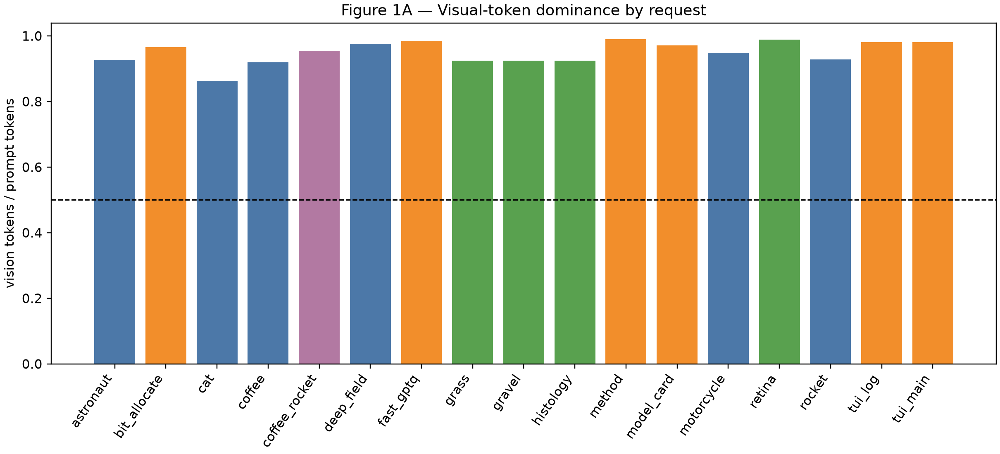
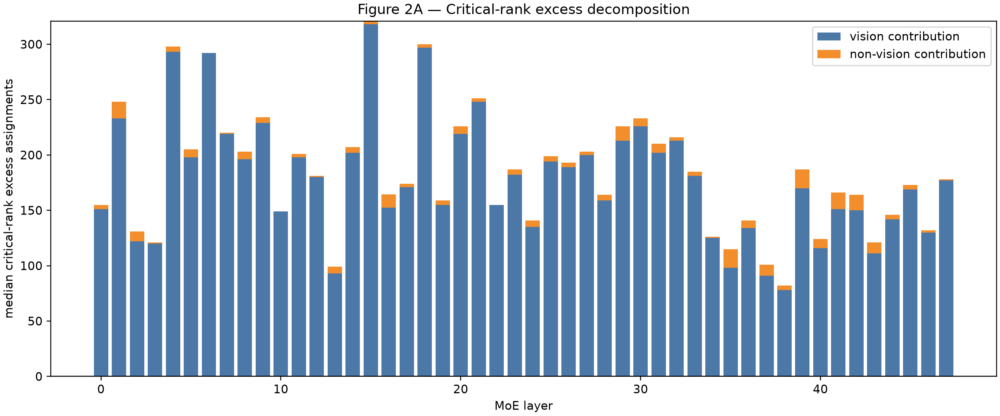
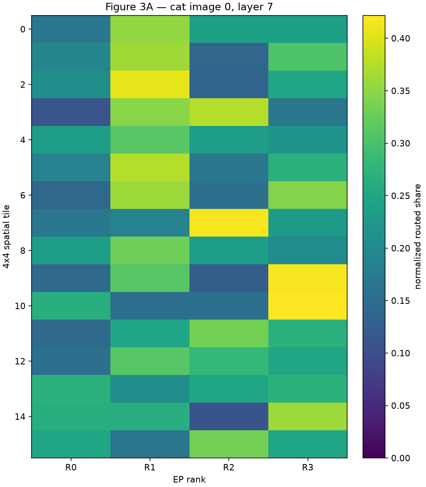
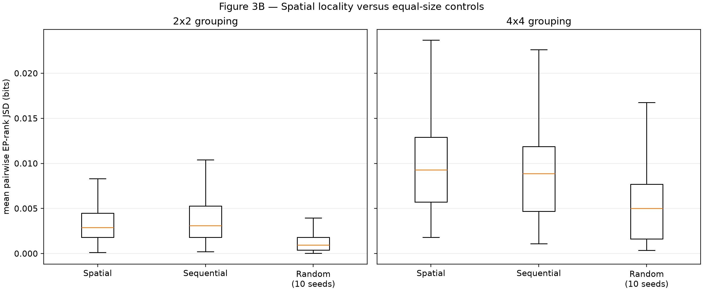

# FlashVEP Vision-Tile Motivation Profiling

## 1. Experiment configuration

Read-only prefill routing capture on Qwen3-VL-30B-A3B-Instruct, BF16,
TP2/DP2/EP4/PP1, DeepEP high-throughput, vLLM 0.20, eager execution, and
physical GPUs 4–7. DBO was disabled to avoid ubatch segmentation; the validated
Attention/DeepStack source fixes remained installed. The router and expert
placement were not changed. vLLM 0.20's public routed-expert buffer does not
handle DeepEP's sequence-parallel shape, so a read-only wrapper saved the exact
`topk_ids` passed to that buffer. TP0/TP1 contiguous sequence chunks were
concatenated per model call, one padding token was removed where needed, and
calls were reassembled in submission order. Every recovered request has shape
`[prompt token, 48 layers, top-k 8]`; IDs span the valid 0–127 expert range.

Spatial coordinates use processor `image_grid_thw` and merge size 2. Qwen3-VL's
post-merge token order is the row-major `(H/2, W/2)` logical grid documented by
the model's encoder metadata path; no fixed 784-token assumption is used.

## 2. Workload/sample manifest

The bounded local suite contains 17 requests across
4 categories. It includes natural scenes/objects,
fine-grained scientific/texture imagery, charts/documents/interfaces, varied
resolutions, and one two-image diagnostic. No dataset was downloaded.

| sample | category | DP rank | prompt tokens | vision tokens | image metadata |
| --- | --- | ---: | ---: | ---: | --- |
| astronaut | natural | 0 | 276 | 256 | astronaut.png [512, 512] grid=[1, 32, 32] |
| bit_allocate | chart_document | 1 | 671 | 648 | bit-allocate.png [1161, 572] grid=[1, 36, 72] |
| cat | natural | 0 | 146 | 126 | chelsea.png [451, 300] grid=[1, 18, 28] |
| coffee | natural | 1 | 248 | 228 | coffee.png [600, 400] grid=[1, 24, 38] |
| coffee_rocket | multi_image | 0 | 511 | 488 | coffee.png [600, 400] grid=[1, 24, 38]; rocket.jpg [640, 427] grid=[1, 26, 40] |
| deep_field | natural | 0 | 857 | 837 | hubble_deep_field.jpg [1000, 872] grid=[1, 54, 62] |
| fast_gptq | chart_document | 1 | 1589 | 1566 | fast_gptq.png [1717, 916] grid=[1, 58, 108] |
| grass | fine_grained | 0 | 277 | 256 | grass.png [512, 512] grid=[1, 32, 32] |
| gravel | fine_grained | 1 | 277 | 256 | gravel.png [512, 512] grid=[1, 32, 32] |
| histology | fine_grained | 1 | 277 | 256 | ihc.png [512, 512] grid=[1, 32, 32] |
| method | chart_document | 0 | 2363 | 2340 | method.png [2481, 960] grid=[1, 60, 156] |
| model_card | chart_document | 0 | 807 | 784 | card_3.png [1575, 519] grid=[1, 32, 98] |
| motorcycle | natural | 1 | 388 | 368 | motorcycle_left.png [741, 500] grid=[1, 32, 46] |
| retina | fine_grained | 1 | 1957 | 1936 | retina.jpg [1411, 1411] grid=[1, 88, 88] |
| rocket | natural | 0 | 280 | 260 | rocket.jpg [640, 427] grid=[1, 26, 40] |
| tui_log | chart_document | 1 | 1255 | 1232 | tui-log-streaming.png [1400, 900] grid=[1, 56, 88] |
| tui_main | chart_document | 0 | 1255 | 1232 | tui-main.png [1400, 900] grid=[1, 56, 88] |

Full paths and SHA-256 values are in `poc_flashvep/deepep_revalidation/results/vision_tile_motivation_20260820_140804/sample_manifest.json`.

## 3. Plot 1 — Visual-token dominance

**PLOT1_STATUS: GO**

Median/mean vision ratios are 0.9550/0.9504; p25/p75 are
0.9242/0.9817. Fractions above 0.5, 0.7, and 0.8 are
1.000, 1.000, and
1.000. Token and top-k assignment ratios agree within
0.000e+00.

*Figure 1A.* Each bar is one real-image request; the dashed line marks vision
majority. Interpret broad category-wide height above the line as visual-token
dominance, not as evidence of spatial routing structure.

## 4. Plot 2 — Vision-dominated critical-rank excess

**PLOT2_STATUS: GO**

For 814 meaningful request-layers, median visual share of
critical excess is 0.9886; vision exceeds
non-vision in 0.996, and explains >70% in
0.975. Median vision-only/nonvision-only
imbalances are 172.50/
12.00 assignments. The decomposition
identity error is at most 0.000e+00. The filter is:
delta_total >= max(8 assignments, 1% of mean rank load).

| category | meaningful layers | median visual contribution | fraction vision > non-vision |
| --- | ---: | ---: | ---: |
| chart_document | 288 | 0.9905 | 1.000 |
| fine_grained | 190 | 0.9866 | 0.989 |
| multi_image | 48 | 0.9929 | 1.000 |
| natural | 288 | 0.9801 | 0.997 |

*Figure 2A.* Layer-wise medians decompose the selected total-load critical
rank's excess into signed vision and non-vision terms. Negative contributions
are retained. This is assignment evidence; per-rank expert CUDA latency was not
captured, so it does not prove a latency-critical rank match.

## 5. Plot 3 — Spatial tile routing signatures

**PLOT3_STATUS: GO**

The preregistered primary metric is mean pairwise JSD of EP-rank routing
distributions. Controls preserve each spatial tile's token count; random uses
10 fixed seeds. The gate requires both 2x2 and 4x4: spatial/random >=1.20,
paired bootstrap 95% CI above zero, and >=70% request-image-layer pairs above
their random mean.

| grid | spatial JSD | sequential JSD | random JSD | spatial/random | 95% CI of difference | fraction spatial > random |
| --- | ---: | ---: | ---: | ---: | --- | ---: |
| 2x2 | 0.003405 | 0.003801 | 0.001290 | 2.640 | [0.001979, 0.002257] | 0.920 |
| 4x4 | 0.009962 | 0.008996 | 0.005267 | 1.892 | [0.004469, 0.004924] | 0.966 |

Secondary expert-JSD spatial/random ratios are
2.036 (2x2) and
1.509 (4x4).

| category | 2x2 ratio | 2x2 fraction > random | 4x4 ratio | 4x4 fraction > random |
| --- | ---: | ---: | ---: | ---: |
| chart_document | 7.117 | 1.000 | 3.991 | 1.000 |
| fine_grained | 1.871 | 0.828 | 1.459 | 0.922 |
| multi_image | 2.008 | 0.844 | 1.699 | 0.958 |
| natural | 2.195 | 0.927 | 1.697 | 0.965 |

*Figure 3A.* The highest-JSD 4x4 request/layer is shown as a diagnostic, not a
cherry-picked aggregate claim; rows are tiles and columns are EP ranks.

*Figure 3B.* Distributions over all request-image-layer observations compare
spatial grouping with same-size sequential and random controls. Spatial values
must exceed random, rather than merely be nonzero, to support novelty.

## 6. ReBA source-image diagnostic

[ReBA](https://arxiv.org/abs/2608.00574) reports source-image routing
correlation and motivates image-level balancing. The two-image request here
yields source-image rank-JSD median
0.002704 over layers. This small diagnostic
is consistent with testing image-level boundaries but is not a ReBA replication.
The spatial gate is deliberately conditioned on beating within-image random
grouping, so image correlation alone cannot make Plot 3 pass. Here, both 2x2
and 4x4 spatial groups beat random controls, adding within-image spatial
structure without contradicting ReBA's coarser image boundary.

## 7. Overall motivation gate

**FINAL MOTIVATION STATUS: GO**

Plot 1, Plot 2, and Plot 3 are independently gated. The overall tile-specific
motivation is GO only when all three pass; a Plot 3 NO-GO makes the tile novelty
story NO-GO even if visual tokens and visual excess dominate.

The strongest positive evidence is Plot 3's spatial/random rank-JSD ratio:
2.640 at 2x2 and 1.892 at
4x4, with paired 95% intervals wholly above zero. The strongest counter-
evidence is that absolute rank-JSD remains small (0.003405
and 0.009962 bits), and the 2x2 sequential control is
slightly stronger than spatial grouping; locality is statistically structured,
but its practical scheduling value is not established.

## 8. Threats and limitations

- The suite is bounded and locally available rather than a random benchmark
  sample; chart/document assets are research/UI figures, not full ChartQA/MMMU.
- Routing IDs, not router weights, were captured; the public vLLM buffer could
  not represent the DeepEP sequence-parallel shape, requiring a read-only hook.
- EP-rank criticality is inferred from assignment counts; actual per-rank expert
  CUDA time was not instrumented.
- Only one multi-image request is available, so the ReBA-style diagnostic is
  descriptive.
- Results cover one model, expert placement, precision, and hardware topology.

## 9. Next single recommended action

Run the identical preregistered spatial/random analysis on a small, locally
cached benchmark subset with source-image IDs (at least 16 samples per category)
before designing any tile scheduler.
