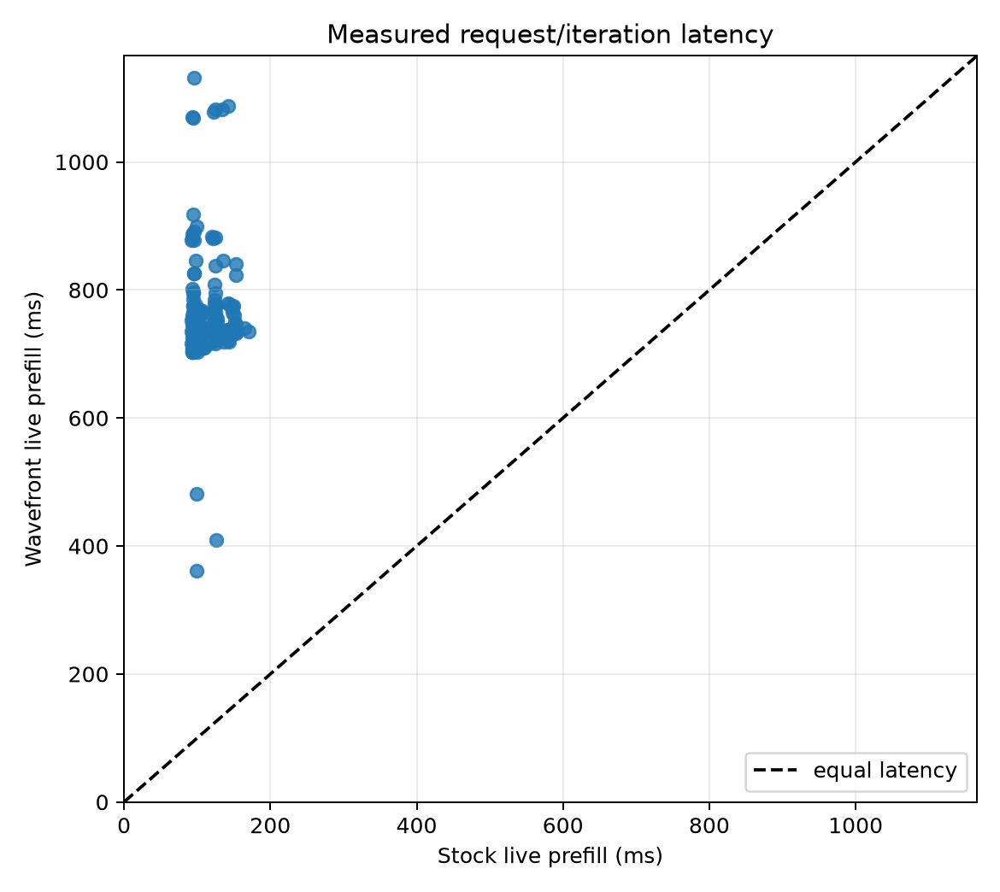
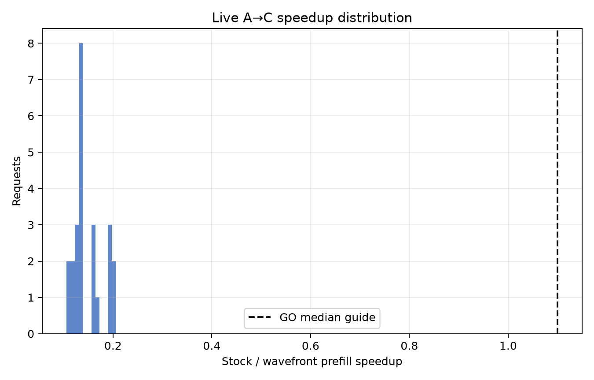
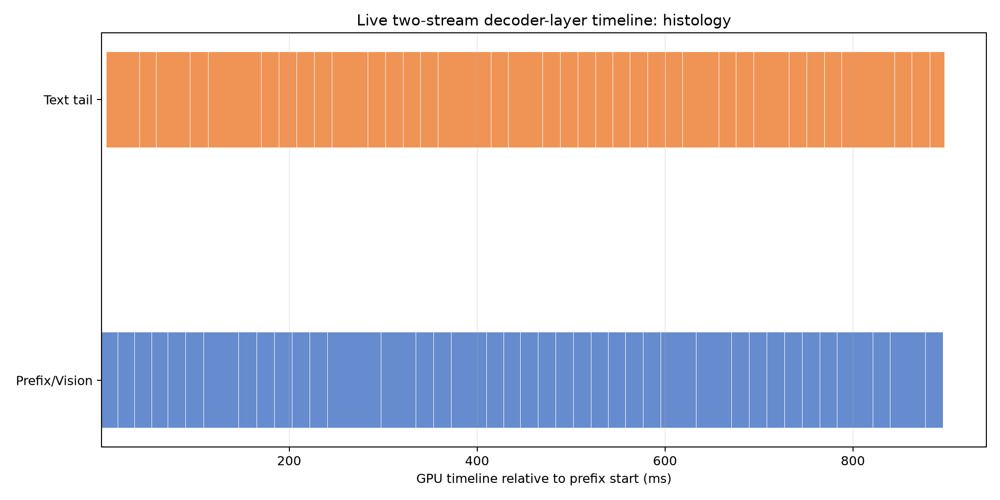

# Live Causal Modality Wavefront A→C PoC

## Final status

`LIVE_CAUSAL_WAVEFRONT: NO-GO`

Stock A and live wavefront C execute the real Qwen3-VL 48-layer forward with real hidden states, attention/KV cache, residuals, routing, DeepEP dispatch/combine, and Triton expert computation. No routing, token, expert, precision, weight, or model output policy is changed.

## Configuration and implementation

- Qwen3-VL-30B-A3B-Instruct BF16, TP2/DP2/EP4/PP1, DeepEP high-throughput, physical GPUs 1,2,3,4 only.
- Fixed previous 24-image workload; two warmups and seven measured iterations per request and mode.
- Both DP ranks receive the same request, avoiding idle-rank padding as a confound.
- Prefix ends at the final image token; every later structural/question/generation-prompt token is the tail.
- C reuses vLLM's corrected ubatch attention metadata and Qwen3-VL DeepStack token-slice lifetime. Prefix and tail use separate compute streams.
- Before tail attention at layer l, its stream waits on the prefix attention/KV-completion event for layer l. Prefix layer l+1 never waits for tail layer l completion.

## Live latency

- Stock median prefill forward: 99.1035 ms.
- Wavefront median prefill forward: 738.4853 ms.
- Request-level median/p25/p95 speedup: 0.1348× / 0.1299× / 0.2024×.
- Requests without regression: 0.00%.
- Driver-side TTFT median A/C: 3063.6429 ms / unavailable (post-measurement flush failure discarded driver records).
- Preregistered timeline actual decoder-layer overlap fraction: 94.55%.

## Correctness

- Output token agreement A/C: True (48 comparisons).
- DP duplicate output agreement: True.
- All four EP ranks completed: True.
- Final-logit max absolute error: 1.406250; minimum cosine: 0.996780455.
- C output tokens were recovered as greedy argmax from the 24 saved correctness logits on each DP leader rank.

## Evidence and limitations

Strongest positive evidence: the causal two-stream path achieved 94.5% measured decoder overlap while preserving all 48 compared greedy output tokens.

Strongest counter-evidence: wavefront median prefill was 7.42× slower than stock; median A→C speedup was only 0.1348× and none of the 24 requests avoided regression.

- GPU prefill timing spans the language-model forward. Driver TTFT additionally contains engine scheduling, vision-encoder/cache behavior, logits, and sampling.
- The PoC uses vLLM DBO's cooperative Python threads plus two compute streams; it is not a production scheduler or optimized kernel.
- Repeating each image can exercise vLLM's multimodal encoder cache after warmup, equally in A and C. The comparison targets decoder-prefill A→C.
- All 240 requested C waves completed and flushed their worker events/logits. The subsequent dummy flush forward hit a CUDA unspecified-launch failure that cascaded into a DeepEP CPU-recv timeout, so C driver-side TTFT records were lost; this happened after the measured workload and does not affect the saved CUDA-event comparison.

## Conclusion

Further vLLM/DeepEP engineering justified: **NO**.

## Artifacts

- Result: `poc_flashvep/deepep_revalidation/results/live_causal_modality_wavefront_20260826_191500/`
- Paired iterations: `paired_iterations.csv`
- Request summary: `request_summary.csv`
- Raw worker CUDA-event summaries: `stock/raw/`, `wavefront/raw/`
