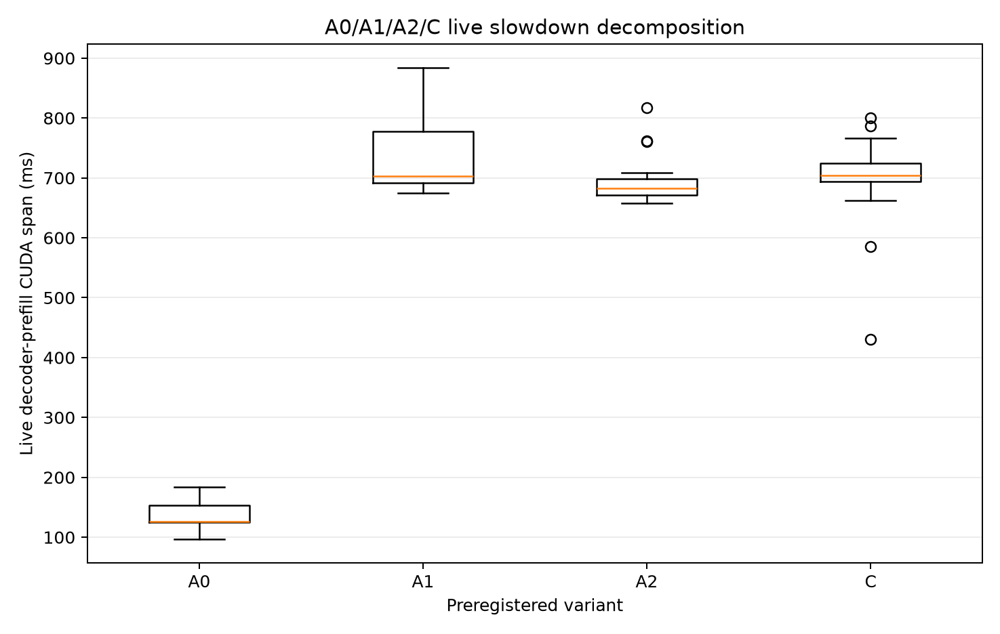
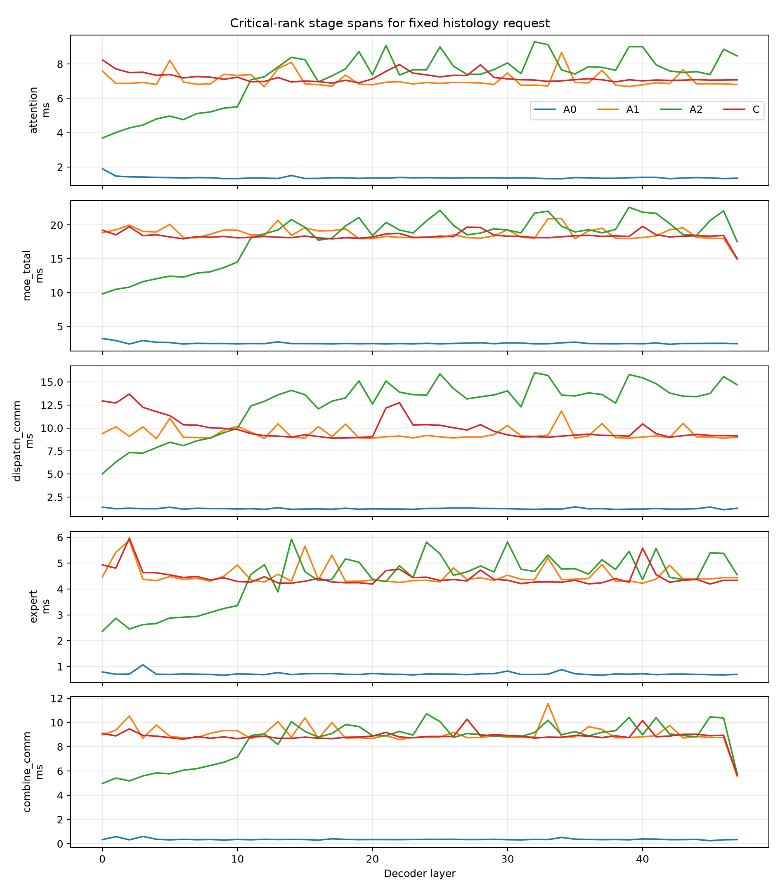

# Live Causal Wavefront Slowdown Forensics

## Result

`ROOT_CAUSE: stock vLLM DBO substrate`

- Exact experiment code SHA: `bff489a0f89e092a700b3ed1b719126dc7f8422a`.
- Qwen3-VL-30B-A3B-Instruct BF16, TP2/DP2/EP4/PP1, DeepEP high-throughput, eager mode, physical GPUs 1,2,3,4 only.
- Fixed requests: coins (128 tokens), histology (277), method (2363); three warmups and ten measured repetitions each.

## Variant latency

| Variant | Median (ms) | p25 | p95 | CV |
|---|---:|---:|---:|---:|
| A0 stock / DBO off | 126.6513 | 125.0392 | 166.4956 | 16.40% |
| A1 stock DBO | 702.4522 | 691.6603 | 843.3941 | 8.12% |
| A2 forced split | 682.3018 | 671.2017 | 761.4037 | 4.88% |
| C two-stream causal | 703.7816 | 693.7349 | 777.8803 | 9.11% |

Incremental factors:

- A1/A0 (stock DBO substrate): 5.5463×.
- A2/A1 (forced prefix/tiny-tail split): 0.9713×.
- C/A2 (separate stream + causal events): 1.0315×.

Per-request medians show the same attribution:

| Request | A0 | A1 | A2 | C | A1/A0 |
|---|---:|---:|---:|---:|---:|
| coins (128 tokens) | 114.5328 | 705.7063 | 674.7779 | 687.4116 | 6.16× |
| histology (277 tokens) | 156.7738 | 753.2884 | 674.5631 | 702.1988 | 4.80× |
| method (2363 tokens) | 125.9059 | 695.9062 | 690.2487 | 721.3095 | 5.53× |



## Layer/stage localization

Mean critical-rank span over 48 layers of the fixed histology request:

| Stage | A0 | A1 | A2 | C |
|---|---:|---:|---:|---:|
| attention | 1.3750 | 7.0567 | 7.2030 | 7.2154 |
| causal_wait | nan | nan | nan | 0.0920 |
| combine_comm | 0.3575 | 9.0221 | 8.4735 | 8.8448 |
| combine_compute | 0.3669 | 9.0194 | 8.5365 | 8.8430 |
| decoder_layer | 3.8305 | 21.3142 | 20.4294 | 21.0620 |
| dispatch_comm | 1.2421 | 9.3875 | 12.5451 | 9.9570 |
| dispatch_compute | 1.0634 | 9.3871 | 10.0632 | 9.5875 |
| expert | 0.7190 | 4.5296 | 4.3894 | 4.4507 |
| moe_total | 2.5154 | 18.6902 | 18.0166 | 18.3563 |

- Dominant inflated stage: **combine_comm**.
- Dispatch/combine timing reports compute-stream exposed spans and DeepEP communication-stream spans separately; it is not a claim of end-to-end collective duration in isolation.



## Instrumentation and lifetime evidence

- Control-file reads inside model/layer/attention forward: 0.
- Cached control reads per rank and variant: {'A0': [42, 42, 42, 42], 'A1': [42, 42, 42, 42], 'A2': [42, 42, 42, 42], 'C': [42, 42, 42, 42]}.
- C dependency events created/max-live/after-cleanup: 48/48/0.
- Event records/waits: 2016/2016. Event count is bounded by 48 layers and reused across waves; no wave-proportional leak occurred.
- Decoder-layer average latency A0/A1/A2/C: 3.8305/21.3142/20.4294/21.0620 ms.
- Per-rank call counts and processed rows are in `call_counts_and_rows.json`; all variants preserve the same total decoder token rows per request.
- For the fixed histology profile, A0 issued 48 attention/dispatch/expert/combine calls per rank; every DBO variant issued 96 while preserving 277 decoder rows and identical aggregate expert input rows/assignments. Thus DBO doubles layer/operator invocations but not useful token work.
- The four-variant contract intentionally has no fifth instrumentation-OFF run. Compared with the earlier run, the same three requests show non-uniform A0 changes (coins 142.04→114.53 ms, histology 95.62→156.77 ms, method 98.28→125.91 ms), so those cross-run differences are not used as an instrumentation-overhead estimate. The causal comparison relies on the identical in-run instrumentation shared by A0/A1/A2/C.

## torch.profiler diagnostic

The profiler run is separate from latency samples. Coarse model/layer start/end intervals are not labeled as GPU overlap. Actual CUDA kernel concurrency, busy fraction, and idle gaps are reported only when a profiler trace was successfully emitted.

```json
{
  "A0": {
    "trace_count": 4,
    "error_count": 0,
    "per_rank": [
      {
        "trace": "torch_trace_rank0_wave42.json",
        "kernel_events": 1716,
        "unique_streams": 2,
        "kernel_span_ms": 216.814814453125,
        "gpu_busy_fraction": 0.34613488514486435,
        "kernel_concurrent_fraction": 0.0,
        "idle_gap_fraction": 0.6538651148551357
      },
      {
        "trace": "torch_trace_rank1_wave42.json",
        "kernel_events": 1716,
        "unique_streams": 2,
        "kernel_span_ms": 217.101642578125,
        "gpu_busy_fraction": 0.3225967088914223,
        "kernel_concurrent_fraction": 0.0,
        "idle_gap_fraction": 0.6774032911085777
      },
      {
        "trace": "torch_trace_rank2_wave42.json",
        "kernel_events": 1716,
        "unique_streams": 2,
        "kernel_span_ms": 217.1591357421875,
        "gpu_busy_fraction": 0.3295454255705292,
        "kernel_concurrent_fraction": 0.0,
        "idle_gap_fraction": 0.6704545744294708
      },
      {
        "trace": "torch_trace_rank3_wave42.json",
        "kernel_events": 1716,
        "unique_streams": 2,
        "kernel_span_ms": 217.2443505859375,
        "gpu_busy_fraction": 0.31605943165551337,
        "kernel_concurrent_fraction": 0.0,
        "idle_gap_fraction": 0.6839405683444866
      }
    ],
    "kernel_events_median": 1716.0,
    "gpu_busy_fraction_median": 0.32607106723097573,
    "kernel_concurrent_fraction_median": 0.0,
    "idle_gap_fraction_median": 0.6739289327690242
  },
  "A1": {
    "trace_count": 4,
    "error_count": 0,
    "per_rank": [
      {
        "trace": "torch_trace_rank0_wave42.json",
        "kernel_events": 3356,
        "unique_streams": 2,
        "kernel_span_ms": 825.78780859375,
        "gpu_busy_fraction": 0.1641717353626127,
        "kernel_concurrent_fraction": 0.011187994159686878,
        "idle_gap_fraction": 0.8358282646373874
      },
      {
        "trace": "torch_trace_rank1_wave42.json",
        "kernel_events": 3356,
        "unique_streams": 2,
        "kernel_span_ms": 830.88423046875,
        "gpu_busy_fraction": 0.07398372468998494,
        "kernel_concurrent_fraction": 0.0,
        "idle_gap_fraction": 0.9260162753100151
      },
      {
        "trace": "torch_trace_rank2_wave42.json",
        "kernel_events": 3356,
        "unique_streams": 2,
        "kernel_span_ms": 811.407841796875,
        "gpu_busy_fraction": 0.1385233044567371,
        "kernel_concurrent_fraction": 0.011457577898310256,
        "idle_gap_fraction": 0.8614766955432629
      },
      {
        "trace": "torch_trace_rank3_wave42.json",
        "kernel_events": 3356,
        "unique_streams": 2,
        "kernel_span_ms": 811.66715625,
        "gpu_busy_fraction": 0.08450292884833605,
        "kernel_concurrent_fraction": 0.0030087463403352414,
        "idle_gap_fraction": 0.9154970711516639
      }
    ],
    "kernel_events_median": 3356.0,
    "gpu_busy_fraction_median": 0.11151311665253658,
    "kernel_concurrent_fraction_median": 0.00709837025001106,
    "idle_gap_fraction_median": 0.8884868833474634
  },
  "A2": {
    "trace_count": 4,
    "error_count": 0,
    "per_rank": [
      {
        "trace": "torch_trace_rank0_wave42.json",
        "kernel_events": 3356,
        "unique_streams": 2,
        "kernel_span_ms": 799.8293349609374,
        "gpu_busy_fraction": 0.10726796173860034,
        "kernel_concurrent_fraction": 0.006766856179874086,
        "idle_gap_fraction": 0.8927320382613997
      },
      {
        "trace": "torch_trace_rank1_wave42.json",
        "kernel_events": 3356,
        "unique_streams": 2,
        "kernel_span_ms": 788.421224609375,
        "gpu_busy_fraction": 0.06864725039025342,
        "kernel_concurrent_fraction": 0.0,
        "idle_gap_fraction": 0.9313527496097466
      },
      {
        "trace": "torch_trace_rank2_wave42.json",
        "kernel_events": 3356,
        "unique_streams": 2,
        "kernel_span_ms": 805.8395380859375,
        "gpu_busy_fraction": 0.3044419390803545,
        "kernel_concurrent_fraction": 0.017761135218055845,
        "idle_gap_fraction": 0.6955580609196454
      },
      {
        "trace": "torch_trace_rank3_wave42.json",
        "kernel_events": 3356,
        "unique_streams": 2,
        "kernel_span_ms": 786.5793203125,
        "gpu_busy_fraction": 0.669265650536893,
        "kernel_concurrent_fraction": 0.13581149034427184,
        "idle_gap_fraction": 0.330734349463107
      }
    ],
    "kernel_events_median": 3356.0,
    "gpu_busy_fraction_median": 0.20585495040947743,
    "kernel_concurrent_fraction_median": 0.012263995698964966,
    "idle_gap_fraction_median": 0.7941450495905226
  },
  "C": {
    "trace_count": 4,
    "error_count": 0,
    "per_rank": [
      {
        "trace": "torch_trace_rank0_wave42.json",
        "kernel_events": 3356,
        "unique_streams": 3,
        "kernel_span_ms": 836.2689111328125,
        "gpu_busy_fraction": 0.03665778695108802,
        "kernel_concurrent_fraction": 0.0,
        "idle_gap_fraction": 0.963342213048912
      },
      {
        "trace": "torch_trace_rank1_wave42.json",
        "kernel_events": 3356,
        "unique_streams": 3,
        "kernel_span_ms": 829.761119140625,
        "gpu_busy_fraction": 0.18732134368312747,
        "kernel_concurrent_fraction": 0.005839641917083849,
        "idle_gap_fraction": 0.8126786563168725
      },
      {
        "trace": "torch_trace_rank2_wave42.json",
        "kernel_events": 3356,
        "unique_streams": 3,
        "kernel_span_ms": 824.818181640625,
        "gpu_busy_fraction": 0.0872196137809339,
        "kernel_concurrent_fraction": 0.0,
        "idle_gap_fraction": 0.9127803862190661
      },
      {
        "trace": "torch_trace_rank3_wave42.json",
        "kernel_events": 3356,
        "unique_streams": 3,
        "kernel_span_ms": 824.7413291015625,
        "gpu_busy_fraction": 0.12420578421391666,
        "kernel_concurrent_fraction": 0.0,
        "idle_gap_fraction": 0.8757942157860833
      }
    ],
    "kernel_events_median": 3356.0,
    "gpu_busy_fraction_median": 0.10571269899742528,
    "kernel_concurrent_fraction_median": 0.0,
    "idle_gap_fraction_median": 0.8942873010025747
  }
}
```

## Correctness and errors

| Variant | Greedy token agreement | DP agreement | Logit maxabs | Min cosine | Runtime errors |
|---|---:|---:|---:|---:|---:|
| A0 | True | True | 0.000000 | 1.000000000 | 0 |
| A1 | True | True | 0.000000 | 1.000000000 | 0 |
| A2 | True | True | 0.578125 | 0.999360919 | 0 |
| C | True | False | 0.578125 | 0.999360919 | 0 |

All three designated final correctness waves in C match A0 on both DP ranks. The `False` DP repeatability flag is caused by one earlier measured coins repetition (wave 10: DP0 token 2124 versus DP1 token 1986); it is retained as counter-evidence rather than hidden. No CUDA or DeepEP runtime error occurred.

## Interpretation

The dominant incremental jump occurs when stock DBO is enabled before any modality split or custom stream/event logic. The wavefront slowdown is therefore primarily a DBO substrate effect in this live DeepEP configuration.

The stage evidence is consistent with that attribution: A1 inflates the mean decoder layer from 3.83 to 21.31 ms, MoE from 2.52 to 18.69 ms, attention from 1.37 to 7.06 ms, and combine-communication span from 0.36 to 9.02 ms. A2 is 2.9% faster than A1, while C adds only 3.1% over A2. The observed 99→738 ms phenomenon is therefore not primarily caused by the forced prefix/tail boundary, the separate tail stream, the 48 reusable causal events, or hot-path filesystem access.

Whether the causal-wavefront concept remains viable: **NO in the current vLLM/DeepEP implementation; the abstract DAG remains unproven**.

Next single action: **Test a non-DBO, explicit single-owner layer pipeline that preserves one DeepEP collective sequence; do not optimize the current DBO wavefront.**

## Artifacts

- Result directory: `poc_flashvep/deepep_revalidation/results/live_wavefront_forensics_20260826_forensics/`
- Aggregates: `latency_samples.csv`, `layer_stage_spans.csv`, `correctness.csv`, `call_counts_and_rows.json`.
- Worker evidence: `<variant>/raw/rank*.json`; full torch-profiler Chrome traces remain in the local result directory because their combined size is about 100 MiB. Their per-rank kernel-count/concurrency/idle summaries are committed in `summary.json`.
