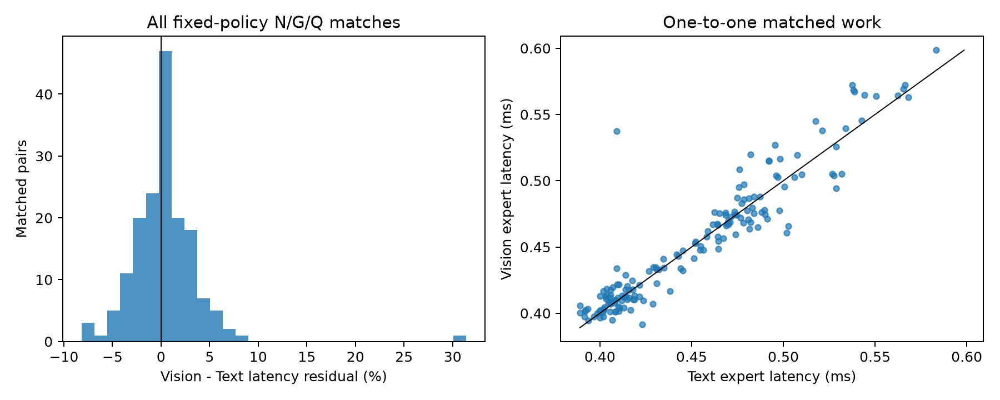
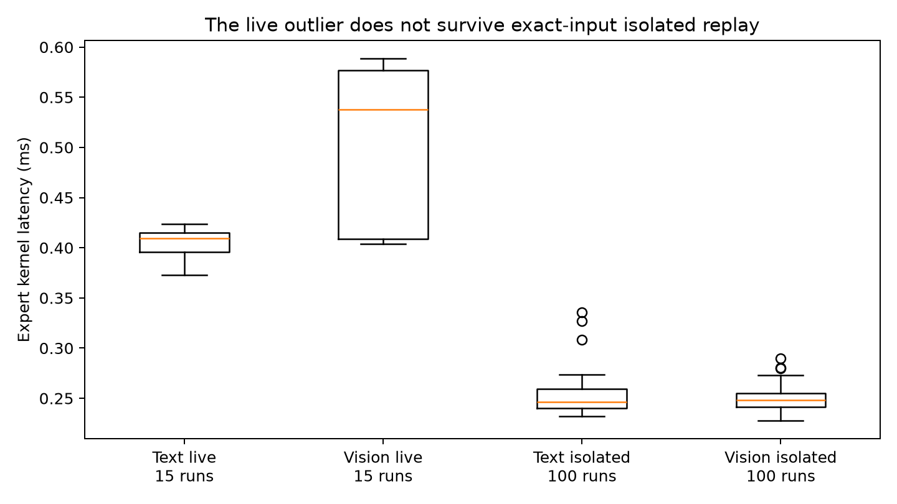
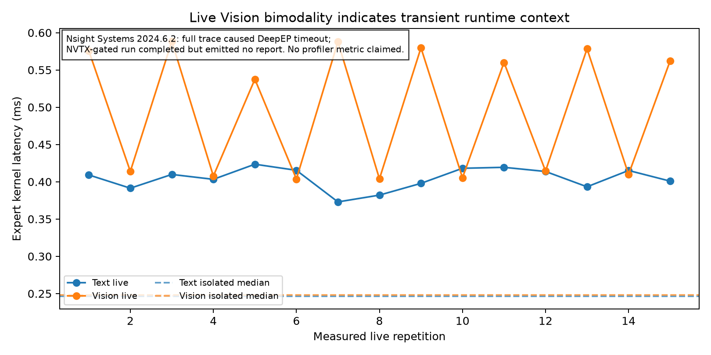

# MLLM EP straggler forensics

## Final gates

- **MLLM_SPECIFIC_STRAGGLER: NO-GO**
- **KERNEL_MECHANISM: NO-GO**

After the preregistered N/G/Q match, mean Vision-minus-Text expert latency is only **0.35%** (median 0.32%; source-request-clustered 95% CI [-0.39%, 0.92%]). The result does not support a Vision-specific residual.

## Environment and provenance

Qwen3-VL-30B-A3B-Instruct, BF16, TP2/DP2/EP4/PP1, DeepEP high-throughput and live `TritonExperts` on physical GPUs 4–7 were reused unchanged. DBO and prefix caching were off. The source trace is `poc_flashvep/deepep_revalidation/results/live_prefill_execution_regime_20260821_111609` and contains 15 measured live repetitions per request/layer/rank. No routing, placement, weight, or kernel behavior was changed.

Profiler audit: `ncu` is absent. `nsys` is NVIDIA Nsight Systems 2024.6.2.225-246235244400v0.

## Stage A — Fixed matched work

The matching policy was fixed before inspecting outcomes: one-to-one Hungarian matching within layer/rank/token bucket, `|ΔN| <= 5%`, exact G, and `|ΔQ| <= 2`. The >=15% latency criterion was used only to select forensic candidates, not to estimate the modality residual.

| Metric | Result |
|---|---:|
| Cross-modality matched pairs | 165 |
| Unique Vision / Text requests | 23 / 23 |
| Mean Vision residual | 0.35% |
| Clustered 95% CI | [-0.39%, 0.92%] |
| Vision slower fraction | 56.97% |
| >=15% cross-modality pairs | 1 |
| >=15% within-Vision / within-Text pairs | 0 / 1 |
| Matched rank is actual critical rank, Vision / Text | 21.82% / 33.33% |

The sole cross-modality forensic candidate was layer 47, rank 3: `color_wheel` versus `text_03_phantom`. N=376/368, G=28/28, Q=28/28, and the original live median gap was 31.37%. Its Vision samples were bimodal, not a stable shifted distribution.

## Stage B — Exact-input isolated replay

At the selected live layer/rank, the actual post-DeepEP expert input, weights, metadata, and observed histogram were reused for 20 warmups and 100 same-stream CUDA-event measurements. Routing edit distance is zero. Idle-DP padding made the replay-run histograms differ by 1–2 assignments from the earlier median repetition, but the compared replay work remained N=375/366 and G=28/28.

| | Text | Vision |
|---|---:|---:|
| Median expert latency | 0.246624 ms | 0.248000 ms |
| IQR | [0.240304, 0.259064] | [0.241224, 0.254872] |
| CV | 6.73% | 4.47% |

The isolated Vision gap is **0.56%**, so the live 31.37% outlier disappears. This rules out the requested >=10% reproducible kernel-internal mechanism.

## Stage C — Bounded profiler result

The initial CUDA+NVTX `nsys` run perturbed startup enough to trigger a DeepEP CPU-receive timeout before any target range. A second run deferred collection to the target NVTX range; all six bounded requests completed, but Nsight emitted no report artifact in this multi-process capture. Consequently no SM, occupancy, DRAM, L2, tensor-core, warp-stall, overlap, or stream metric is claimed.

The strongest available context evidence is non-profiler timing: Vision live CV was 17.16% with two latency bands, Text live CV was 3.61%, while isolated medians differ by only 0.56%. This is consistent with transient runtime/system-context interference, but it does not identify a specific preceding kernel, cache, stream, or communication cause.

## Interpretation and limitations

“Vision” was not assumed causal. Across all fixed-policy matches its residual is below 1% and its clustered CI crosses zero. The only large cross-modality example fails isolated reproduction and is therefore not evidence of a Vision-specific GEMM regime. The missing Nsight artifact prevents finer attribution of the transient live outlier. The prior trace also includes stock idle-DP padding, which explains the 1–2 assignment replay-run drift and is explicitly not treated as visual work.

The next work should **pivot generic**, not remain MLLM-specific: instrument a profiler-compatible, modality-agnostic live EP latency-tail harness that records surrounding streams/communication without Nsight-induced DeepEP timeout. Do not build a Vision-specific optimization from this result.
