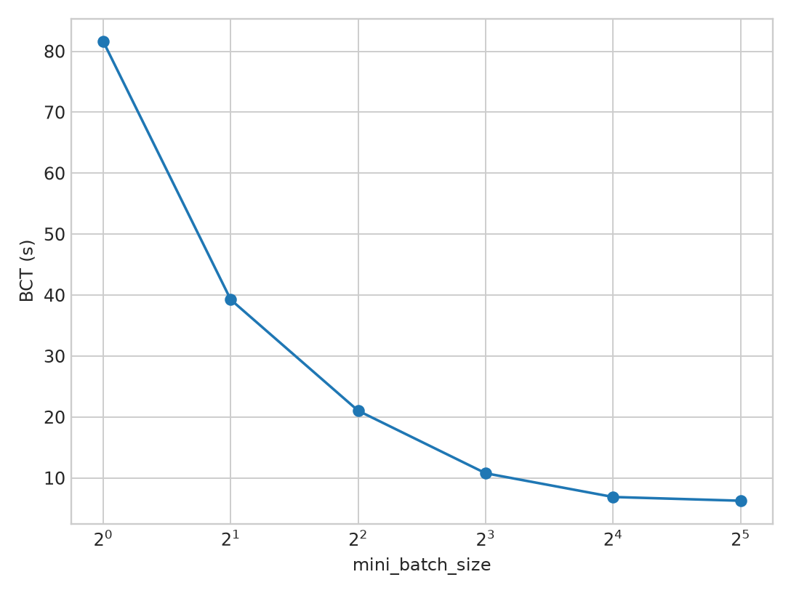
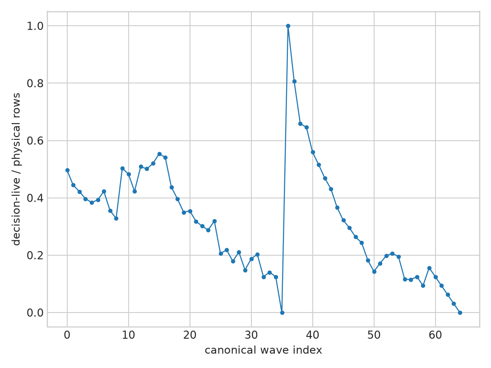
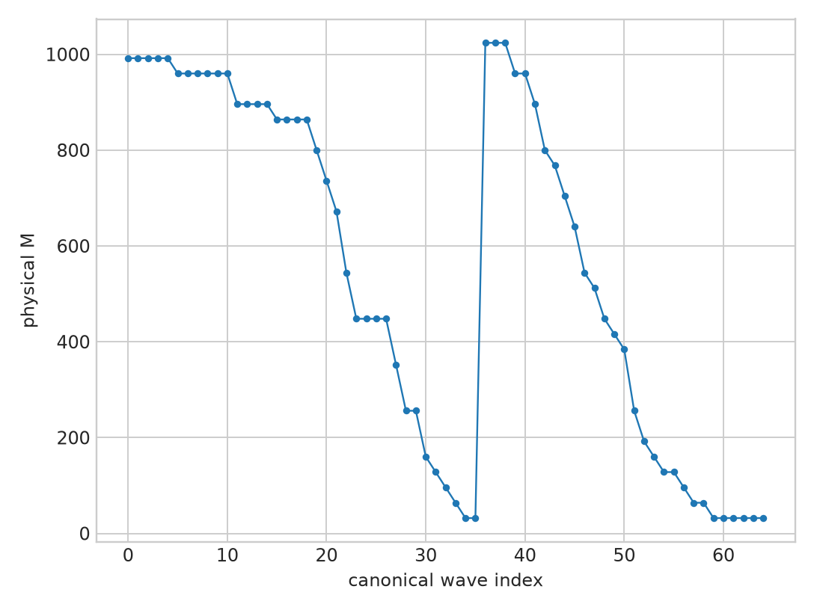
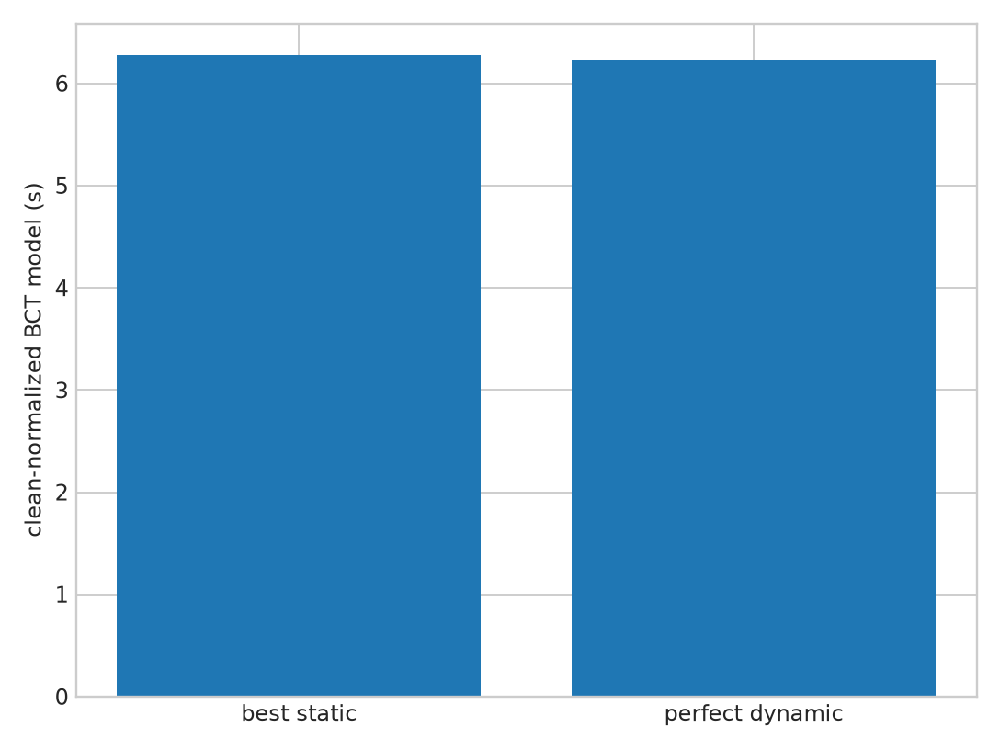

# Refinement-Aware Dynamic Wave Sizing (RAWS) PoC

## Final status: **NO-GO**

On the validated LLaDA2.0-Flash 100B true-EP4 substrate, the best static policy is
`mini_batch_size=32`. A zero-controller-cost, future-aware, ready-set-feasible
per-wave oracle improves its clean-normalized request BCT by only **0.650%**.
This is below the specification's 3% NO-GO boundary and far below the 5% live
prototype gate.

The negative is not caused by a lack of refinement dynamics. Decision-live work
falls sharply and aggregate EP geometry changes. It fails because the current
runtime still emits 32 physical rows per scheduled request and because larger EP
waves amortize fixed/router/expert costs so strongly that partitioning the ready
pool almost never helps.

## Scope and substrate

- Model: `LLaDA2.0-flash-744c3f8`, BF16, 102.89B parameters, 32 layers,
  hidden size 4096, 256 routed experts, top-8, one shared expert, block length 32.
- Runtime: dInfer `1ffeb961cd258bede74fcf5ca8a416ae6d57b18f` with the previously
  validated bridge for dense TP4 plus routed EP4, DP1, no sequence parallelism.
- EP truth: 64 complete routed experts per rank; DeepEP normal mode performs real
  remote dispatch, owner-rank expert execution, and reverse combine. The parent
  PoC measured a 75.1% remote-assignment fraction and validated representative
  layer numerical correctness.
- Hardware: physical H100 GPUs 0,1,2,3 only. GPUs 4--7 were never touched.
- Controlled workload: 32 submitted bounded GSM8K requests, generation budget 32,
  confidence threshold 0.9, identical prompt pool and decoding configuration.
- Clean runs are the performance source of truth. Shape/timing traces use
  same-device CUDA events at layers 1/16/31 and have 14.3--76.4% observer tax;
  trace wall time is never reported as clean speed.

## 1. Static sweet spot

| mini | physical M for a full wave | restarts | BCT median | throughput | peak HBM/rank |
|---:|---:|---:|---:|---:|---:|
| 1 | 32 | 3 | 81.610 s | 32.645 tok/s | 56.864 GiB |
| 2 | 64 | 3 | 39.261 s | 67.861 tok/s | 56.864 GiB |
| 4 | 128 | 3 | 21.038 s | 126.702 tok/s | 57.870 GiB |
| 8 | 256 | 3 | 10.783 s | 247.164 tok/s | 61.657 GiB |
| 16 | 512 | 5 | 6.890 s | 386.915 tok/s | 67.968 GiB |
| **32** | **1024** | **5** | **6.273 s** | **424.145 tok/s** | **79.116 GiB** |

Mini32 is the best static configuration. Mini16 is 9.82% slower. The bounded
GSM8K score is 5/32 for mini1/2/4/16/32 and 6/32 for mini8; the one-answer
variation is treated as BF16/batching-order sensitivity, not a quality benefit.

## 2. Refinement state and physical EP shape

The canonical mini32 trace contains 65 logical waves and 1,127 request-forwards.
Across representative layers:

| phase | waves | ready requests median | physical M median | live ratio | active experts | rows/active expert | tiny-expert fraction | rank CV | fanout | remote fraction |
|---|---:|---:|---:|---:|---:|---:|---:|---:|---:|---:|
| early | 2 | 32 | 1024 | 0.904 | 175.8 | 50.68 | 0.317 | 0.476 | 2.972 | 0.753 |
| middle | 27 | 28 | 896 | 0.445 | 206.3 | 35.39 | 0.229 | 0.330 | 2.999 | 0.755 |
| late | 36 | 5.5 | 176 | 0.181 | 167.2 | 8.73 | 0.480 | 0.302 | 3.013 | 0.753 |

Decision-live ratio is strongly correlated with physical M (Spearman 0.915),
rows per active expert (0.911), dispatch bytes (0.917), and model-forward cost
(0.825). However, this aggregate transition is dominated by the ready pool
draining. Every scheduled request still generates exactly 32 physical rows.
Rank fanout and remote fraction barely change, so the communication regime does
not undergo the hypothesized phase crossover.

## 3. Replay and the essential population-control correction

The raw phase-conditioned cost matrix, in clean-normalized model milliseconds per
request-forward, is:

| phase | mini1 | mini2 | mini4 | mini8 | mini16 | mini32 |
|---|---:|---:|---:|---:|---:|---:|
| early | 74.623 | 36.715 | 18.844 | 10.542 | 6.029 | **5.528** |
| middle | 74.165 | 35.934 | 18.632 | 9.586 | 5.565 | **3.965** |
| late | 74.398 | 35.784 | 18.657 | 9.876 | **6.958** | 9.666 |

Naively selecting mini16 for late phase produces a **12.905%** apparent dynamic
gain. It is invalid: mini16 late samples see a median of 16 ready requests, while
mini32 late samples see only 5.5. The comparison silently manufactures work that
is not ready and confuses population size with treatment effect.

The primary oracle instead takes every exact mini32 ready set and partitions that
same set by each candidate mini size. It never adds, drops, or moves a request
across scheduling points. Ties preserve the existing mini32 wave.

## 4. Perfect dynamic oracle

| oracle | clean-normalized cost | BCT gain | interpretation |
|---|---:|---:|---|
| best static mini32 | 6273.443 ms | 0% | clean five-run median anchor |
| naive phase dynamic | 5463.879 ms | 12.905% | **excluded population confound** |
| perfect feasible per-wave dynamic | 6232.662 ms | **0.650%** | primary upper bound |
| hypothetical compacted-runtime dynamic | 4142.935 ms | **0.224% over its own best static** | offline sensitivity only |

Only 1/65 canonical waves has a strict split benefit: wave 37, early phase,
32 ready requests/M1024, estimated mini16 saving 40.781 ms. All other waves retain
mini32. The oracle knows future costs, has zero controller/switching overhead, and
optimistically assigns the entire clean BCT to controllable model work. Therefore
0.650% is an upper bound for this measured workload, not an expected live gain.

## 5. Predictor, live prototype, TP4 control

No predictor can turn a 0.650% perfect upper bound into a 5% result. Phase,
logical liveness, physical M, tiny-expert fraction, active experts, fanout, rank CV,
critical-rank work, and bytes were therefore not fit into a learned controller.
The simplest correct policy is to aggregate all ready requests up to mini32/HBM.

Per the working contract:

- live RAWS was **not implemented** because the perfect oracle is below 5%;
- no live dynamic quality/speedup claim is made;
- TP4 control was **not triggered** because EP4 is below the 5--8% threshold;
- deep novelty audit was **not triggered** because there is no economic candidate.

This is a gate-driven stop, not an environment block.

## 6. Epoch-like compaction sensitivity

Epoch was not implemented. An offline sensitivity model contracts only the prior
observer-light MLP share (53.06%) according to measured decision-live ratio and
then reruns the same ready-set-feasible partition oracle. Dynamic wave sizing gains
only **0.224%** over the best compacted static policy. Live-row compaction therefore
does not expose a hidden RAWS opportunity in this trace.

## 7. Online relevance

Continuous batching decides which requests enter a ready pool; RAWS would decide
how that fixed ready pool is partitioned. The current offline trace has no arrival
or queueing delay and cannot justify a serving claim. New arrivals could refill the
late pool, but the objective would have to include execution savings minus waiting
delay. The present evidence says only that, for an already-ready pool, maximal
aggregation is nearly always optimal.

## Required final questions

1. **Does optimal mini size differ across refinement phase?** Not under a valid
   ready-set control. Mini32 wins/ties in 64/65 waves.
2. **Does refinement phase alter physical sparse workload shape?** Aggregate shape
   changes substantially, but mostly through ready-pool contraction; per-request
   physical M remains 32 and communication geometry is nearly invariant.
3. **Is physical shape a better winner predictor than phase?** It describes cost,
   but there is no material winner variation to predict.
4. **Does perfect dynamic beat best static?** Yes, but only 0.650%.
5. **Does a live controller improve BCT?** Not tested; the oracle failed its gate.
6. **Does hypothetical compaction create opportunity?** No; 0.224% dynamic gain.
7. **Is online serving promising?** Unproven; queueing-aware experiments would be a
   distinct study, and this trace supplies no positive headroom evidence.
8. **Is the effect EP-specific?** Not established; TP4 control was not warranted.
9. **Is there a paper-level novelty claim?** No. Dynamic mini sizing without
   material topology-specific headroom is generic tuning.
10. **Recommendation?** Stop RAWS for this dense-block LLaDA2.0-Flash EP4 regime.

## Final decision

**NO-GO.**

The causal chain is:

`refinement changes logical state` **YES** →
`aggregate physical shape changes` **PARTLY/READY-POOL-DRIVEN** →
`optimal EP wave size changes` **NO, EXCEPT 1/65 WAVES** →
`perfect dynamic beats best static materially` **NO, 0.650%**.

## Artifact index

- Working spec: [`refinement_aware_dynamic_wave_sizing_poc_spec.md`](refinement_aware_dynamic_wave_sizing_poc_spec.md)
- Task root: [`poc_refinement_wave_sizing/`](../../poc_refinement_wave_sizing/README.md)
- Static results: [`STATIC_WAVE_SUMMARY.csv`](../../poc_refinement_wave_sizing/STATIC_WAVE_SUMMARY.csv)
- Shape data: [`WAVE_SHAPES.csv`](../../poc_refinement_wave_sizing/WAVE_SHAPES.csv)
- Dynamic oracle: [`DYNAMIC_ORACLE.csv`](../../poc_refinement_wave_sizing/DYNAMIC_ORACLE.csv)
- Final decision: [`final_decision.md`](../../poc_refinement_wave_sizing/reports/final_decision.md)
- Runtime patch: [`dinfer_true_ep4_and_raws_trace.patch`](../../poc_refinement_wave_sizing/patches/dinfer_true_ep4_and_raws_trace.patch)
