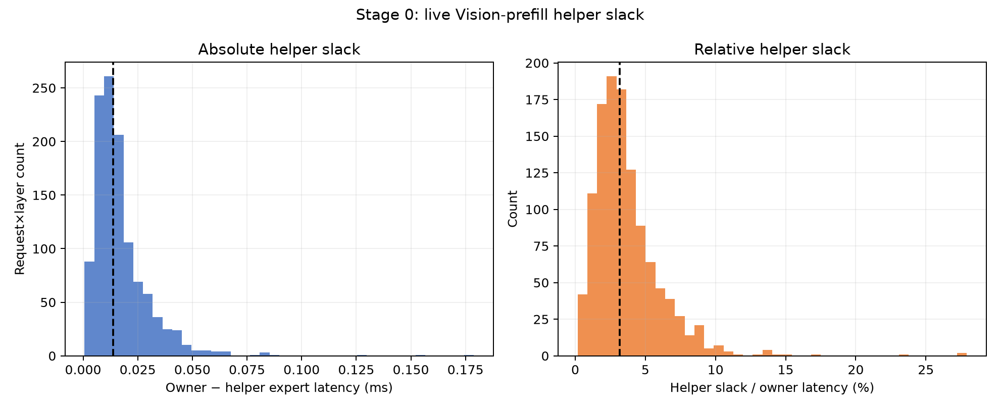
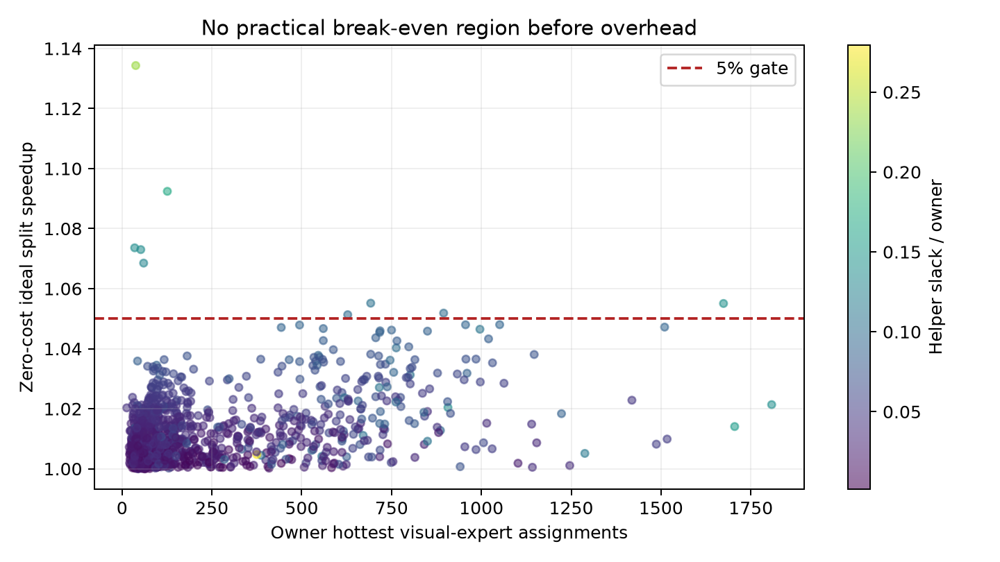
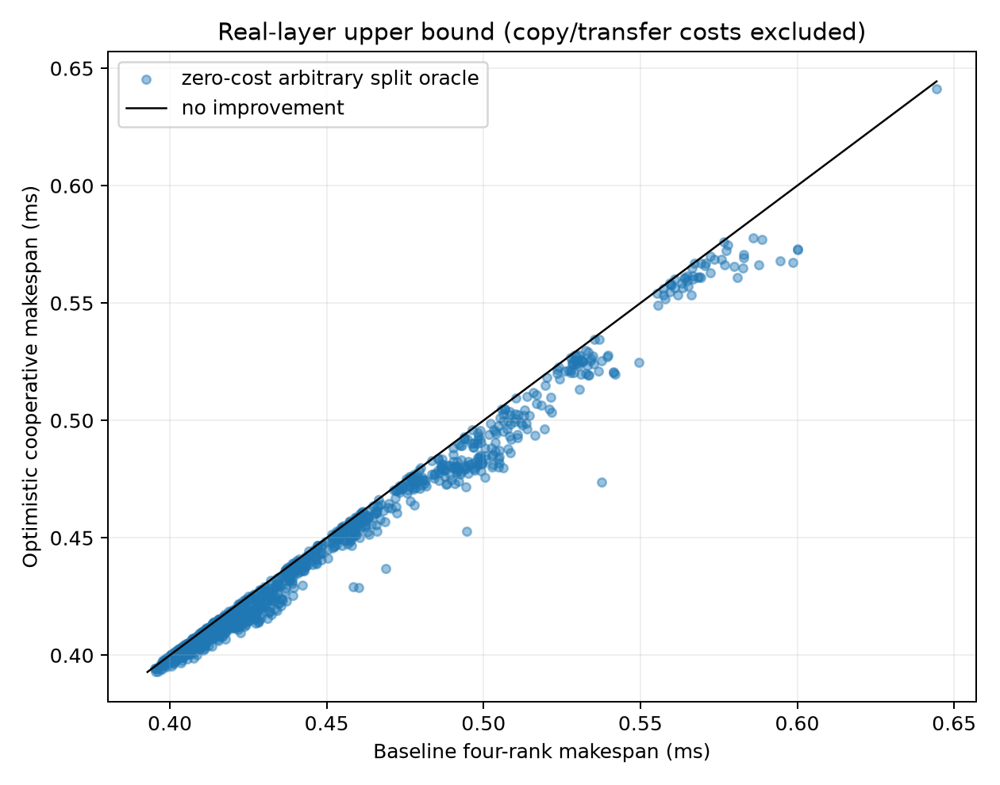
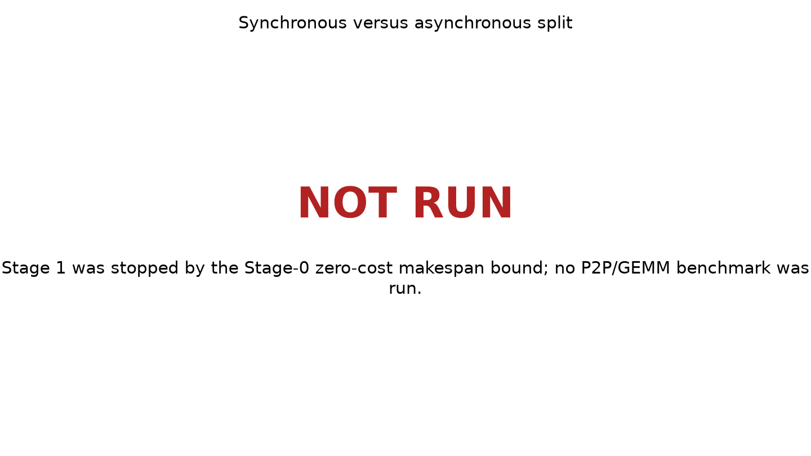

# Vision-Covered Cooperative Expert Split PoC

## Final status

`VISION_COVERED_SPLIT: NO-GO`

The preregistered Stage-0 stop condition fired. Actual four-rank Vision-prefill expert timings have too little owner/helper separation for cooperative work transfer to produce a material layer-makespan gain. Stages 1–3 were therefore not run, and no P2P, GEMM, DeepEP scheduler, routing, or kernel change was implemented.

## Scope and source

- Base: `587bb6710d80f64ebb05c60548a5361f5a6f0a28`
- Model/runtime represented by the source trace: Qwen3-VL-30B-A3B-Instruct, BF16, TP2/DP2/EP4/PP1, vLLM 0.20, DeepEP high-throughput, TritonExperts, DBO and prefix caching off.
- Source: the existing validated live-prefill trace `live_prefill_execution_regime_20260821_111609`.
- Coverage: 24 real-image requests × 48 layers × 4 EP ranks, 15 measured repetitions per rank; 1,152 request-layer observations after taking each rank's median.
- Visual-token ratio across the 24 requests: median 93.60%, range 83.72–99.03%.
- Visual hot-expert counts were reconstructed from each request's exact routed expert IDs using only real image-token rows. Median owner hot-expert load was 102 assignments (p95 797; max 1,808).

The reused source trace was historically collected on physical GPUs 4–7. The current task launched no GPU work because Stage 0 is explicitly permitted to reuse an existing trace and required immediate termination on insufficient slack. Consequently, no GPU outside the requested physical 1–4 set was exposed or used during this run. Hardware-location dependence remains a limitation.

## Stage 0 — real slack

For every request/layer, owner is the slowest of four EP ranks and helper is the fastest non-owner rank. Helper slack is `T_owner - T_helper`.

| Metric | Median | p75 | p95 | Maximum |
|---|---:|---:|---:|---:|
| Helper slack | 0.013664 ms | 0.020904 ms | 0.041262 ms | 0.178848 ms |
| Slack / owner latency | 3.161% | 4.587% | 8.154% | 27.921% |

The most optimistic arbitrary-split bound assumes all of the following for free: perfectly divisible owner work, perfectly linear compute, no expert-weight copy, no activation/output transfer, no kernel launch, and no copy/GEMM contention. It balances owner/helper at `(T_owner + T_helper)/2`, while respecting the second-slowest rank.

Even this unattainable upper bound gives:

- Median speedup: 1.00950×, or 0.941% makespan reduction.
- p95 speedup: 1.03348×.
- Fraction reaching 1.05×: 9/1,152 = 0.781%.
- Fraction reaching 1.10×: 1/1,152 = 0.087%.

The Stage-0 early-stop interpretation was fixed as median zero-cost speedup below 1.05× with fewer than 10% of observations reaching 1.05×. This is aligned with the requested 5% HOLD floor and was not adjusted after inspecting individual layers.

## Fixed spill-ratio oracle

The preregistered 25% and 50% hot-expert spill ratios were also evaluated under zero overhead and perfectly linear per-row cost. This is more favorable than any realizable replica mechanism.

| Spill | Median speedup | p95 speedup | Fraction regressed | Fraction ≥1.05× |
|---:|---:|---:|---:|---:|
| 25% | 0.99810× | 1.02616× | 53.73% | 0.087% |
| 50% | 0.96614× | 1.00665× | 91.58% | 0.347% |

The helper commonly becomes the new straggler because the available slack is much smaller than a fixed fraction of the hot expert. This counter-evidence exists before replica or activation-transfer cost is added.

## Stage 1 — 2-GPU overlap microbenchmark

`NOT-RUN (Stage-0 stop)`

- Standalone expert P2P copy time: not measured.
- Copy/GEMM overlap contention: not measured.
- Break-even token count: no practical aggregate break-even can be established because the zero-copy upper bound already fails.
- Sync versus async makespan: not measured.

The required figure is retained as an explicit not-run marker rather than fabricated data.

## Stage 2 — 4-GPU trace replay

`NOT-RUN (Stage-0 stop)`

There is no measured cooperative makespan or helper-output correctness result. The baseline makespan distribution is real live timing; the plotted cooperative values are explicitly labeled zero-cost upper bounds, not replay measurements.

## Stage 3 — MLLM relevance

`NOT-RUN (Stage-0 stop)`

Real Vision-hot expert size is large (median 102, p95 797), but token count is not the limiting variable: the four rank completion times are already tightly clustered. No measured Stage-1 break-even exists, so “coverage above break-even” is undefined. A text-control comparison would not rescue a mechanism whose Vision upper bound is below the gate.

## Interpretation

Strongest positive evidence: a very small tail exists—nine request/layers exceed a 1.05× zero-cost oracle, and one reaches 1.134×. These are too rare to support a general mechanism.

Strongest counter-evidence: median ideal improvement is only 0.94%, before paying for approximately one expert replica, activation movement, output return, launches, or contention. Fixed 25%/50% spill ratios regress 53.7%/91.6% of layers even with every overhead removed.

Full DeepEP integration is not justified. The bottleneck is insufficient rank slack, not an unmeasured P2P-copy implementation detail.

## Limitations

- Stage 0 reuses a historical homogeneous-H100 trace from physical GPUs 4–7 rather than recollecting on 1–4. A device-specific timing shift large enough to overturn the zero-cost bound is unlikely but was not measured.
- Rank latency uses 15-repeat medians and excludes dispatch/combine; this is appropriate for expert-compute makespan but does not model an end-to-end scheduler.
- The oracle assumes expert latency is perfectly divisible and linear. This intentionally overestimates achievable benefit.
- Rare high-slack layers might support a highly selective policy, but selecting only those layers would be a different, post-hoc workload policy and was not pursued.

## Artifacts

- Result directory: `poc_flashvep/deepep_revalidation/results/vision_covered_expert_split_20260825_232020/`
- Raw derived rows: `stage0_slack_rows.csv`
- Gate summary: `summary.json`
- Reproduction: `poc_flashvep/scripts/run_vision_covered_expert_split_stage0.sh`

## Single recommended next action

Do not implement cooperative expert replication; redirect effort to a mechanism that reduces work or communication without relying on pre-existing inter-rank expert slack.
